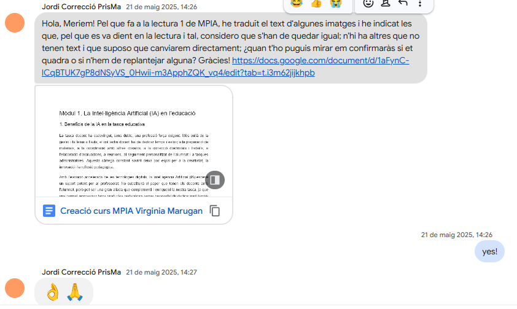
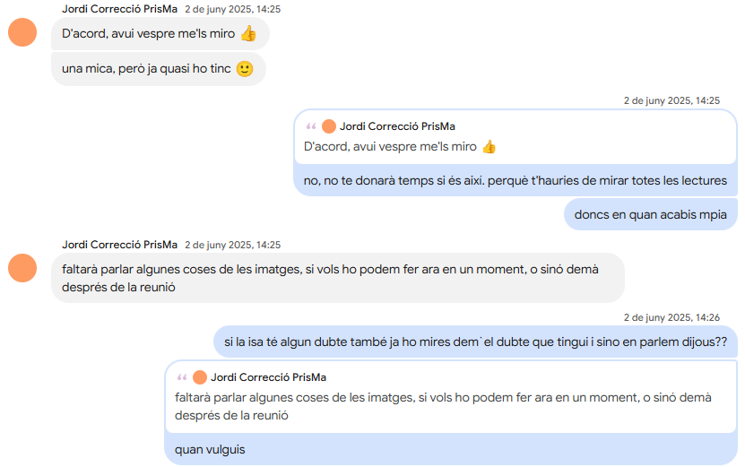
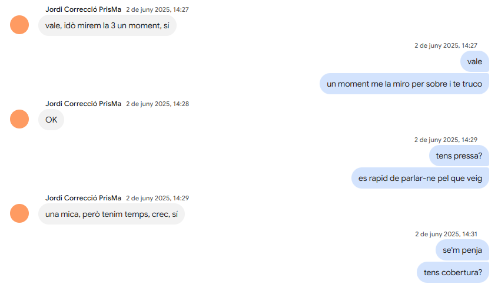
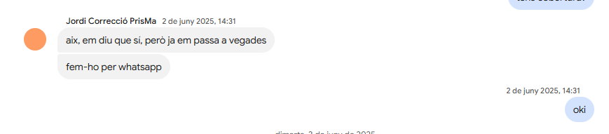

# Resposta Punt Per Punt Depurada

Aquest document es una proposta de treball per a revisio juridica. Cada punt separa l'afirmacio de Jordi, la resposta factual proposada, les proves a aportar i les cauteles.

## Punt 01. Mitja Jornada, Hores Extres I Suposada Insuficiencia Estructural

**Afirmacio de Jordi**

Jordi afirma que la mitja jornada era insuficient i que, per seguir el ritme de tasques, feia de manera frequent una quantitat significativa d'hores extres.

**Resposta proposada**

Aquesta afirmacio no queda acreditada en aquests termes amb els informes exportats de Woffu. El treball efectiu es calcula com `Hores ordinàries + Extr. a compensar`, mantenint les hores justificades separades. Entre gener i agost de 2023 consten 566 h 02 m treballades davant 592 h 30 m teoriques, a mes de 113 h 25 m justificades; no consta un excés sostingut sobre la mitja jornada. El salt rellevant apareix al setembre, amb 170 h 21 m treballades davant 75 h teoriques.

Segons la informacio de direccio recollida, el setembre de 2023 va fer mes hores per una necessitat puntual vinculada a la subvencio d'ACOS i TICS i a la sortida dels cursos a l'octubre. Aquesta situacio no acredita que Jordi ja estes fent jornada completa des del juny ni que existis una promesa de jornada completa incondicionada.

Tampoc consta cap registre on l'empresa imposes a Jordi la realitzacio d'hores extres. Segons la informacio recollida, quan Jordi deia que no podia arribar o no podia assumir un termini, l'empresa i l'equip sovint movien dates, replanificaven o absorbien l'impacte dels seus retards. Aquest context es rellevant per contestar la idea que les hores puntuals fossin fruit d'una imposicio empresarial.

Per tant, no es pot presentar com a fet acreditat que Jordi treballés de manera sostinguda per sobre de la mitja jornada entre juny i agost de 2023 ni que aquesta jornada fos estructuralment insuficient per si mateixa. La seva carta no diu literalment que ja treballés a jornada completa, però Meriem declara que Jordi ho va afirmar verbalment més d'una vegada. La resposta ha de diferenciar l'afirmació escrita de les manifestacions orals, que poden ser objecte de prova testifical si se'n concreten les circumstàncies i les persones presents.

També cal diferenciar la seva referència inicial a hores extres significatives «en determinades temporades» de l'afirmació posterior que «sempre acabava fent hores extres» perquè la mitja jornada no bastava. La primera pot descriure puntes estacionals; la segona suggereix una insuficiència recurrent. Atès que la relació laboral es remunta al 2011, aquesta última afirmació requereix concretar des de quan passava, quines hores generava cada període, com es compensaven i si abans de 2023 s'havia demanat ampliar la jornada. Que no s'ampliés abans no prova per si sol que no hi hagués hores extraordinàries, però debilita la presentació d'una insuficiència estructural antiga si no s'acompanya d'aquesta concreció.

Meriem no va presenciar la conversa anterior amb Júlia i Paula. El que pot declarar directament és que Jordi li va explicar que havia plantejat una vegada l'ampliació i que elles li havien respost que no hi havia prou feina per ocupar una jornada completa. Meriem sí recorda directament que Jordi li havia manifestat que vivia bé amb la mitja jornada i que no necessitava ampliar-la, fins i tot quan ella li expressava preocupació pel seu futur econòmic. Aquest context no elimina possibles puntes d'hores extres, però contradiu que la mitja jornada hagués estat percebuda històricament per Jordi com a estructuralment insuficient. Cal recollir el testimoni de Júlia i Paula per confirmar la conversa original, i el de Cristina sobre el funcionament anterior.

Tampoc es pot deduir la insuficiència de la mitja jornada del simple fet que s'acordés ampliar-la. La mateixa carta identifica altres finalitats de l'acord: incorporar la tutorització del seu curs a la nòmina per evitar el perjudici fiscal que Jordi atribuïa al cobrament separat; mantenir diferenciats només els imports d'autoria; destinar els mesos sense curs a traduccions i adaptacions; i valorar que assumís noves funcions. Per tant, l'ampliació projectada es pot explicar com una reorganització retributiva, contractual i funcional de futur. No acredita per si sola que la feina ordinària anterior ja exigís estructuralment una jornada completa.

Els testimonis coincidents d'Adam, Isa, Meriem i el mateix Jordi situen l'octubre de 2024 com un mes addicional de descans que Adam li va concedir perquè no havia pogut aplicar abans el canvi contractual, sense descomptar-lo d'una borsa. Jordi no va efectuar cap fitxatge real durant aquell mes. El registre de Woffu no el categoritza com a vacances o absències, sinó que genera o imputa exactament l'horari teòric de tots els dies laborables —primer 07:30-15:06 i després 08:00-15:36—, sense descansos ni diferències, fins a mostrar 167 h 12 m. Aquest total no són hores treballades confirmades i no s'ha d'incloure com a treball efectiu. La coincidència testifical acredita la concessió; gestoria o l'administració de Woffu només han d'explicar el mecanisme pel qual el sistema va omplir el mes com si fos jornada ordinària.

**Proves**

- Resums Woffu 2023 preparats al dossier.
- Captures Woffu incloses a `annexos_captures/WF_woffu_jordi/CAPTURES WOFFU/`.
- Documents de treball sobre calcul Woffu: `48_analisi_woffu_jordi.md`, `54_resum_woffu_2023_per_declaracio.md`, `55_resum_woffu_2024_2025_per_declaracio.md`.
- `09_RESPOSTES_ADAM_DIRECCIO_RECOLLIDES.md`.

**Validacio pendent**

- Revisio de Woffu per gestoria/advocada.
- Confirmar si les hores compensades apareixen formalment descomptades i com s'han d'interpretar juridicament.

**Cautela**

No afirmar "no feia hores" en termes absoluts. Es mes defensable dir que les hores no acrediten un excés sostingut sobre la mitja jornada ni la seva insuficiencia estructural. No negar tampoc que Jordi afirmés oralment que ja feia una jornada completa: distingir aquesta prova testifical del contingut literal de la carta.

## Punt 02. Elaboracio Del Seu Curs I Treball Fora De Jornada

**Afirmacio de Jordi**

Jordi vincula l'elaboracio del seu curs amb dedicacio fora de jornada i vacances acumulades.

**Resposta proposada**

Cal diferenciar la feina ordinaria com a treballador de PrisMa de l'autoria/tutoritzacio d'un curs propi. Si l'elaboracio del curs es retribuia com a autoria o mitjancant un sistema diferenciat, no es pot presentar automaticament com a carrega ordinaria de la jornada laboral sense revisar contractes, acords i rebuts.

La mateixa carta vincula l'ampliació amb el problema fiscal que Jordi deia patir en cobrar separadament la nòmina, la tutorització i l'autoria. Segons la informació aportada, PrisMa va procurar evitar-li aquest problema incorporant la tutorització dins la jornada ampliada i assignant-li altres funcions per completar-la, mentre l'autoria continuava diferenciada. Aquest antecedent presenta l'ampliació com una acomodació contractual i retributiva en benefici seu i una previsió de tasques futures; no com la prova que les funcions ordinàries de la mitja jornada ja exigissin vuit hores.

Meriem recorda que Jordi va mantenir durant mesos la queixa que la declaració de la renda li sortia a pagar. Aquesta reiteració acredita el seu malestar i la seva explicació del problema, però no demostra que la causa fos la forma de pagament de PrisMa. Determinar-la exigia que Jordi o el seu assessor revisessin la seva situació fiscal completa. PrisMa, per la seva banda, ha de poder acreditar la correcció dels pagaments, certificats i retencions que li corresponien; acreditat això, el resultat global de la declaració personal no se li pot imputar sense una anàlisi causal específica.

El fet que PrisMa disposés de diversos tutors i no constin altres queixes equivalents sobre la declaració de la renda pot aportar context, però no resol per si sol la qüestió fiscal perquè cada situació personal pot ser diferent. Per atribuir a PrisMa una penalització tributària concreta caldria aportar el càlcul, la documentació fiscal i el nexe causal amb la forma de pagament. Fins aleshores, s'ha de descriure com un problema manifestat per Jordi al qual l'empresa va intentar donar resposta, no com un perjudici causat i quantificat de manera objectiva.

**Proves**

- Contractes o acords d'autoria.
- Rebuts/factures d'autoria.
- Comunicacions sobre autoria i tutoritzacio.
- Documentació o càlcul fiscal en què Jordi fonamenti el perjudici que atribueix al cobrament separat.
- Criteri contractual i retributiu aplicat als altres tutors, sense incorporar dades fiscals personals innecessàries.
- Certificats de retencions i comprovació de gestoria sobre els pagaments i retencions practicats a Jordi.

**Validacio pendent**

- Adam/gestoria han de confirmar el tractament contractual i fiscal de l'autoria.

**Cautela**

No entrar en valoracions fiscals sense documentacio.

## Punt 03. Suposada Promesa De Jornada Completa

**Afirmacio de Jordi**

Jordi afirma que Adam li havia assegurat el pas a jornada completa en una data concreta.

**Resposta proposada**

No queda acreditat que Adam o PrisMa donessin a Jordi una data concreta i tancada per passar-lo a jornada completa. Segons les respostes de direccio recollides, no es va parlar d'una data, sino d'una possibilitat condicionada a la recepcio d'una subvencio vinculada als cursos d'ACOS i TICS i a la situacio economica de PrisMa, que en aquell moment tenia perdues.

L'ampliacio de jornada tampoc es plantejava com un increment automatic sense noves funcions. Incloia la tutoritzacio del curs de CAT de Jordi, l'assumpcio de cursos de PrisMa sense autoria per reduir despesa externa, i la creacio de cursos per a Mirada Pedagogica amb l'objectiu de generar ingressos recurrents.

Aquest context tambe es rellevant respecte de Meriem. Segons la informacio aportada, Meriem donava suport a buscar una formula viable per ampliar la jornada de Jordi, va parlar-ne amb ell i va mirar opcions perque l'ampliacio pogues sortir a compte per a l'empresa.

La imatge d'una actitud continuadament hostil per part de Meriem no resulta coherent amb aquest antecedent. Si queda confirmat per Adam/Pablo o per altres testimonis, el fet que Meriem defenses internament l'ampliacio de jornada de Jordi fins a vuit hores, coneixent la situacio economica i personal que ell exposava, contradiu la presentacio d'una voluntat sostinguda de perjudicar-lo o sotmetre'l a un tracte advers. Aquest antecedent no exclou que posteriorment hi poguessin haver discrepancies professionals, tensions o comunicacions fermes sobre terminis i tasques, pero si serveix per descartar una lectura de persecucio sostinguda.

Segons el relat de Meriem, en una conversa tensa sobre aquesta qüestio, Adam va oferir a Jordi parlar en privat o en un espai separat, pero Jordi va preferir mantenir la conversa davant Meriem i Isa per tenir testimonis. Meriem i Isa no haurien buscat presenciar aquesta conversa; al contrari, la van viure com una situacio molt incomoda i, segons Meriem, molt desagradable per a elles. Aquesta dada es rellevant per contextualitzar l'afirmacio de Jordi que l'equip li va "girar l'esquena": la intervencio de Meriem i Isa no es va produir per atacar-lo, sino arran de la insistencia de Jordi que Adam podia haver-li fet el contracte o haver buscat alguna formula irregular malgrat la situacio de perdues. Segons Meriem, Jordi si va plantejar aquesta mena d'opcions irregulars, i ella i Isa van intervenir per explicar que una empresa amb perdues no podia ampliar jornada sense justificacio ni fer operacions irregulars. Aixo s'ha de validar amb Adam i Isa abans de presentar-ho com a fet tancat, especialment pel que fa a les paraules exactes utilitzades i a com Adam va viure o gestionar aquella conversa.

**Proves**

- Testimonis de Meriem, Isa, Pablo i Adam.
- Woffu 2023.
- Comunicacions sobre canvi de jornada, si existeixen.
- `09_RESPOSTES_ADAM_DIRECCIO_RECOLLIDES.md`.

**Validacio pendent**

- Adam ha de confirmar exactament que es va prometre o no, i en quins termes.
- Confirmar que no existeixen correus, WhatsApps o actes sobre aquestes converses.
- Confirmar si Adam/Pablo poden validar que Meriem va defensar o recolzar internament l'ampliacio de jornada.
- Confirmar amb Adam i Isa l'episodi en que Adam va oferir parlar en privat i Jordi va preferir parlar davant Meriem i Isa per tenir testimonis.
- Confirmar amb Adam i Isa les paraules exactes utilitzades per Jordi quan, segons Meriem, va plantejar formules irregulars o no compatibles amb la situacio economica/legal de l'empresa.
- Confirmar amb Isa la incomoditat viscuda per ella i Meriem, i amb Adam com va viure o gestionar la conversa.

**Cautela**

No presentar com a fet tancat una conversa privada si no hi ha document o testimoni directe.

## Punt 04. Permis De Paternitat

**Afirmacio de Jordi**

Jordi afirma que va moure dates del permis per afavorir l'empresa i que hi va haver negligencia en la informacio del tramit.

**Resposta proposada**

Aquest punt s'ha de respondre amb documentacio formal: sol.licituds, Woffu, comunicacions, gestoria i Seguretat Social. La informacio interna disponible indica que Jordi volia tenir jornada completa perque el permis de paternitat li resultes economicament mes favorable, pero cal acreditar-ho amb missatges o testimonis abans d'incloure-ho.

Segons la informacio recollida, no consta que PrisMa demanes formalment a Jordi que canvies dates del permis per necessitats de l'empresa. Per tant, si Jordi afirma que va moure dates per afavorir PrisMa, caldria que aquesta afirmacio quedes acreditada amb una sol.licitud, correu, WhatsApp, comunicacio de gestoria o altre document on constes aquesta peticio empresarial.

El WhatsApp grupal del 23/10/2023 aporta una dada anterior al naixement: Jordi comunica que ja havia parlat amb Lia i que ella tenia desembre i gener reservats sencers per substituir-lo, amb una visita prevista al despatx a principis de novembre per preparar la tutoritzacio. Aixo acredita que la substitucio dels primers mesos ja estava organitzada abans del naixement. No desmenteix per si sol la seva afirmacio sobre l'ajornament posterior de la segona part del permis, perquè la previsio de desembre i gener es compatible amb els primers dos mesos que ell mateix descriu. Per determinar el pla inicial complet i el motiu real de qualsevol canvi cal revisar la sol.licitud inicial, les modificacions, Woffu, gestoria i les comunicacions posteriors.

Meriem pot testificar que Jordi havia explicat que volia passar a jornada completa perque el permis de paternitat es calcules sobre jornada completa i li resultes economicament mes favorable. Mentre no es localitzi prova escrita, aquest punt s'ha de mantenir com a testimoni i context, no com a fet documental tancat ni com a motiu exclusiu.

Pel que fa al mes internament descrit com a "regalat" o no descomptat, segons la informacio recollida no consta a l'equip com una obligacio pendent de PrisMa cap a Jordi. La decisio d'Adam s'hauria d'explicar, pendent de validacio documental, com una concessio excepcional o periode no descomptat adoptat davant les exigencies de Jordi i tenint en compte la seva situacio personal, amb voluntat d'ajudar-lo i no perjudicar-lo.

**Proves**

- Woffu.
- Sol.licituds o comunicacions del permis.
- Comunicacions amb gestoria.
- Missatges de Jordi sobre el motiu economic, si es decideix aportar-los.
- Testimoni de Meriem sobre converses relatives al motiu economic de la jornada completa.
- Confirmacio d'Adam sobre el motiu i la figura formal del mes concedit/no descomptat.
- `09_RESPOSTES_ADAM_DIRECCIO_RECOLLIDES.md`.

**Validacio pendent**

- Gestoria i advocada.
- Adam ha de confirmar que no hi va haver peticio formal de PrisMa per canviar dates del permis.
- Buscar correus o WhatsApps sobre el motiu economic de la jornada completa.
- Confirmar si Adam, Pablo o gestoria tambe en tenen constancia.
- Confirmar com consta formalment el mes concedit/no descomptat a Woffu, nomina i gestoria.

**Cautela**

No convertir una interpretacio sobre motius personals en afirmacio sense prova. Evitar usar "regal" com a categoria formal en la resposta externa si Woffu/gestoria el classifiquen d'una altra manera.

## Punt 05. Vacances I Hores Acumulades

**Afirmacio de Jordi**

Jordi vincula vacances acumulades i manca de descans amb un volum de tasques inassumible.

**Resposta proposada**

Les vacances acumulades s'han de contrastar amb Woffu, dies de permis, baixes, compensacions i descansos efectivament gaudits. El fet que hi hagi saldo acumulat no acredita per si sol pressio empresarial o mobbing. 🟨 **EVIDÈNCIA PENDENT:** incorporar les ocasions en que l'empresa o companyes li van recomanar descansar, agafar vacances o prioritzar salut.

En la mateixa linia, l'existencia d'hores puntuals o saldos de compensacio no acredita imposicio d'hores extres si no hi ha una ordre concreta de l'empresa. Cal diferenciar hores realment fitxades, saldos administratius, hores compensades i replanificacions acceptades.

**Proves**

- Woffu.
- Missatges on se li diu que descansi o que no treballi en cap de setmana.
- Actes on es parlen vacances o disponibilitat.

**Validacio pendent**

- Resum formal de vacances i compensacions per gestoria.

## Punt 06. Acomiadaments I Referencia A Cristina

**Afirmacio de Jordi**

Jordi afirma que Adam va mentir o el va incriminar davant l'equip en relacio amb l'acomiadament de Cristina.

**Resposta proposada**

Aquesta afirmacio requereix concrecio exacta. Cal indicar que no acredita cap actuacio de Meriem, Isa o Pablo contra Jordi. En tot cas, es tracta d'una interpretacio sobre una decisio empresarial i sobre una conversa interna que ha de contestar direccio.

Segons la informacio recollida, no es va dir mai en una reunio que Jordi ja sabes que s'acomiadaria Cristina. El que si s'hauria comentat es que Jordi havia afirmat que es veia capacitat per assumir algunes tasques de Cristina i que ja les havia fet anteriorment. Aquesta afirmacio va sorprendre l'equip, perque Meriem indica que no s'ajustava a la realitat en aquests termes. Si s'utilitza aquest punt, s'ha de presentar com a testimoni/context i no com a prova documental, ja que no consta acta, correu o missatge concret.

Pel que fa als acomiadaments, la informacio recollida apunta a una situacio economica negativa, perdues constants i necessitat d'una reorganitzacio. La formulacio mes prudent per a una contestacio externa seria indicar que es tractava de decisions economiques i organitzatives de direccio, sense entrar en una comparacio detallada de terceres persones si no es imprescindible.

**Proves**

- Actes de reunions sobre reorganitzacio, si existeixen.
- Testimonis dels assistents.
- Respostes de direccio recollides a `09_RESPOSTES_ADAM_DIRECCIO_RECOLLIDES.md`.

**Validacio pendent**

- Adam i advocada.

**Cautela**

No discutir el fons de l'acomiadament de Cristina si no es necessari per contestar l'acusacio de Jordi.

## Punt 07. Judicis Sobre Prescindibilitat D'IT I Plans B

**Afirmacio de Jordi**

Jordi afirma que era mes logic acomiadar una informatica perque part de les tasques es podien subcontractar amb menys cost i perque aparentment tenien plans B.

**Resposta proposada**

Aquesta afirmacio es una opinio personal de Jordi sobre la prescindibilitat d'altres companyes, no una dada objectiva. No consta que disposes d'estudi de costos, criticitat, carrega de treball o impacte operatiu. Les tasques d'IT eren elevades i transversals, i la subcontractacio d'una especialitat concreta no substitueix tot l'abast real del departament.

El document intern [`Informe funcions Meriem i Isa.docx`](https://drive.google.com/drive/folders/1JzVYiLlCKKRT762oINOUznR8qJYd_USQ?usp=sharing) inventaria l'abast efectiu de les funcions assumides per totes dues. En el cas de Meriem, recull responsabilitats transversals de direccio tecnologica, desenvolupament full stack, arquitectura i administracio de bases de dades, integracions, seguretat, accessibilitat, suport tecnic avançat, ecommerce, pagaments, facturacio, intranets, Moodle, gestio de projectes, SEO, Google Ads, analitica, email marketing i produccio de continguts. En el cas d'Isa, descriu funcions operatives especialitzades de Moodle i produccio de cursos, operacions sobre dades, ecommerce, publicacio, mailings, primera linia de suport, Secretaria i coordinacio operativa amb proveïdors. L'informe es un inventari intern i, per tant, les funcions principals s'han de contrastar amb projectes, codi, Trello, correus, campanyes, sistemes desenvolupats i testimonis; pero permet delimitar quines activitats s'haurien d'incloure en una comparacio economica completa.

La qüestio no es si una empresa externa podria assumir una tasca concreta per menys d'una nomina, sino si podria substituir conjuntament tot aquest abast amb el mateix coneixement dels sistemes, disponibilitat, temps de resposta, coordinacio, responsabilitat sobre el resultat i continuïtat. Sense una oferta real que inclogui aquestes mateixes funcions i condicions, comparar el preu d'un servei parcial amb una nomina interna no permet concloure objectivament que la feina de Meriem i Isa fos prescindible ni que pogues ser substituïda per un cost inferior. Subcontractar una especialitat pot ser util, com ja succeeix amb determinats serveis, pero no equival a substituir el conjunt integrat de funcions que soste la creacio i publicacio dels cursos, la captacio, la inscripcio, el cobrament, la facturacio, l'acces a Moodle, el seguiment, la comunicacio i la resolucio d'incidencies.

En canvi, si que existeix una dada concreta pendent de documentar sobre externalitzacio puntual de correccio: segons la informacio aportada, la correccio externa de CANVA va tenir un cost de 700 euros. Tambe hi hauria un full de seguiment de CANVA, comparable als altres seguiments de cursos, on es pot contrastar la planificacio amb les entregues reals. Segons Meriem, aquest full mostra que Ariadna va entregar la correccio en termini o abans del previst. Aquesta dada no converteix automaticament cap lloc de treball en prescindible, pero si contradiu que Jordi utilitzi el criteri abstracte de "subcontractacio mes barata" per assenyalar precisament IT sense haver fet cap estudi equivalent sobre l'abast real del departament.

Un segon element rellevant es la manca d'un full d'estil formal. Segons Meriem, es va comunicar a Ariadna que el corrector intern no havia deixat documentat cap full d'estil aplicable. Si es valida amb la comunicacio corresponent, aquest fet acredita una dependencia organitzativa del criteri personal de Jordi i ajuda a explicar per que Meriem i Isa havien d'acabar consolidant o recordant criteris de correccio en alguns materials. Aquest punt s'ha de formular com a problema de documentacio i continuïtat interna, no com a atac personal.

El fet que una persona tingui o no un pla B no acredita cap motiu objectiu d'acomiadament ni cap actuacio irregular de l'empresa.

Segons la informacio recollida, Jordi si va participar almenys en una conversa sobre possibles acomiadaments, en la qual va coincidir amb la idea que Laura podia ser una de les persones afectades. Aixo no converteix aquella conversa en criteri formal d'empresa, pero si contradiu una posicio completament passiva o aliena a les valoracions sobre qui podia sortir.

**Proves**

- Document intern `Informe funcions Meriem i Isa.docx`, disponible a la carpeta compartida del Drive.
- 🟨 **EVIDÈNCIA PENDENT:** contrastar les funcions principals de l'informe amb projectes, codi, Trello, correus, campanyes, sistemes desenvolupats i testimonis.
- Actes i captures sobre feina real d'IT.
- Comparativa amb externalitzacio puntual de correccio CANVA, incloent cost indicat de 700 euros pendent de documentacio comptable.
- Full de seguiment de CANVA amb planificacio i entregues reals.
- Comunicacio a Ariadna indicant que no hi havia full d'estil formal documentat.
- Carta de Jordi, on formula opinio sobre acomiadar una informatica.
- Testimonis sobre converses informals relatives a possibles acomiadaments.

**Validacio pendent**

- Costos i abast objectiu amb direccio/gestoria.
- Validar amb factura, rebut o document comptable el cost de 700 euros de la correccio externa de CANVA.
- Validar el full de seguiment de CANVA i extreure dates previstes versus dates reals d'entrega.
- Localitzar la comunicacio a Ariadna sobre la inexistencia de full d'estil formal.

## Punt 07B. Despatx, Teletreball I Coordinacio

**Afirmacio de Jordi**

Jordi vincula la mala gestio dels acomiadaments i de l'abandonament del despatx amb negligencia empresarial.

**Resposta proposada**

El manteniment temporal del despatx es pot explicar com una decisio organitzativa orientada a garantir coordinacio, reunions presencials i seguiment de tasques. Segons la informacio recollida, el despatx era especialment util per coordinar feines que en teletreball quedaven sense resposta, sense entrega o requerien recordatoris reiterats. Amb Jordi hi havia problemes recurrents de coordinacio i seguiment, pero Meriem tambe indica que el problema de comunicacio i organitzacio afectava el funcionament general de l'equip quan no hi havia reunions presencials.

Segons Meriem, ella havia detectat que els dies presencials facilitaven que Jordi avances feina o resolgues pendents, i per aquest motiu sovint es quedava amb ell dimarts i dijous per mirar tasques. Aquesta adaptacio li impedia avançar feina propia dins l'horari ordinari i l'obligava a acabar-la fora d'horari. Aquest punt s'ha de presentar com a testimoni i context, amb suport indirecte de Woffu, retards, replanificacions i xats, excepte que es localitzi una prova directa.

El cost aproximat del despatx seria d'uns 700 euros mensuals amb tot inclos, pendent de documentar. En tot cas, la decisio de mantenir-lo primer i deixar-lo despres respondria a criteris economics i organitzatius, no a una actuacio dirigida contra Jordi.

**Proves**

- Cost del despatx, pendent de documentar.
- Acta 09/01/2025: deixada del despatx i pas a reunio setmanal per videotrucada, amb possibilitat de reunions presencials puntuals.
- Acta 28/04/2026: cerca de sala per reunions presencials dos dies per setmana, dimarts i dijous.
- Acta 06/05/2026: propostes de coworking/despatx i opcio Estudio3/Vilablareix.
- Acta 13/05/2026: ajust de reunions presencials per feina de Verifactu.
- Actes 02/06/2026, 09/06/2026, 23/06/2026 i 07/07/2026: reunions setmanals presencials.
- Acta 07/07/2026: consta que no s'ha pogut fer la coordinacio prevista amb Jordi ni presencialment ni virtualment, i que es mante sistema de coordinacio presencial dos dies per setmana.
- Testimonis d'Adam, Meriem, Isa i Pablo.
- Woffu, xats, Trello i historials de tasques com a suport indirecte de dificultats de coordinacio, disponibilitat i seguiment.

**Validacio pendent**

- Adam i advocada.
- Confirmar cost exacte i motiu formal de manteniment/supressio del despatx.
- Confirmar si hi ha testimonis directes que recordin que Meriem es quedava dimarts i dijous amb Jordi per desbloquejar tasques.

**Cautela**

No convertir aquest punt en una discussio economica excessiva si no es necessari. En resposta externa pot ser suficient dir que eren decisions organitzatives i economiques de direccio.

## Punt 07C. ERTE I Suposada Manipulacio

**Afirmacio de Jordi**

Jordi fa referencia a l'ERTE com una de les estrategies o elements de manipulacio que atribueix a Adam/direccio.

**Resposta proposada**

Segons la informacio recollida, l'ERTE si es va valorar o demanar formalment el gener de 2025 i es va comunicar a tot l'equip. Per tant, no es pot presentar simplement com una maniobra oculta o com un element de manipulacio sense concretar fets, documents i dates.

A mes, un ERTE no hauria fet desapareixer tota la feina. Hauria pogut suposar deixar de fer o ajornar projectes que reduissin la carrega d'algunes persones, pero determinades tasques imprescindibles per mantenir l'activitat minima i evitar el tancament de l'empresa s'haurien hagut de continuar fent o redistribuir.

**Proves**

- Adam i gestoria.
- Comunicacions o actes de gener de 2025 sobre l'ERTE, si existeixen.
- Documentacio administrativa de l'ERTE o de la seva valoracio, si existeix.
- Testimonis de l'equip sobre la comunicacio general.

**Validacio pendent**

- Confirmar resultat formal exacte de l'ERTE amb Adam/gestoria.
- Localitzar documentacio o comunicacions internes.

**Cautela**

No afirmar que l'ERTE es va concedir, denegar o tramitar en uns termes concrets fins tenir documentacio. El punt defensable ara es que es va valorar/demanar en un context economic dificil, que no era una questio amagada a Jordi i que no hauria eliminat automaticament tota la feina.

## Punt 08. Tasques Inassumibles

**Afirmacio de Jordi**

Jordi afirma repetidament que les tasques eren inassumibles.

**Resposta proposada**

Es tracta d'una valoracio subjectiva que cal contrastar amb la carrega real assignada. La documentacio disponible mostra que altres membres de l'equip assumien carrega elevada i transversal, i que diverses tasques de Jordi requerien seguiment, replanificacio o redistribucio.

Per evitar una resposta simplista, convé diferenciar entre l'inventari historic de tasques de Jordi i la carrega concreta de 2025 abans de la baixa. Segons Meriem, entre 2022 i 2025, en diferents moments i pendent d'acotar per anys, Jordi corregia o revisava mailings, guies, lectures, activitats, qüestionaris, devolucions, campus, campanyes, slides, textos web, missatges comercials, articles d'Educat, curriculums, comunicats i criteris linguistics puntuals. En 2024 tambe revisava publicacions, stories i reels d'Instagram i Facebook. Aquest inventari no acredita per si sol que la carrega fos inassumible; serveix per delimitar quins blocs de feina existien i quins s'han de provar per dates.

Pel 2025, el recull intern situa la feina principal de Jordi abans de la baixa en aquests blocs:

- Correccio de mailings.
- Correccio de xarxes.
- Quatre tastets previstos, dels quals Meriem indica que nomes se n'hauria completat un.
- Cursos TSA, MPIA i GUST.
- Redaccio, com a novetat, dels subtitols i textos destacats dels videos de presentacio de MPIA, GUST i TSA.

Meriem indica que els subtitols/textos destacats d'ALBUM i CANVA els va fer ella, no Jordi. Sobre GUST, cal afegir que no es tractaria d'un curs creat des de zero per Jordi. Segons Meriem, GUST era un curs muntat o substancialment preparat, i les proves de campus mostren materials previs creats per l'autor. 🟨 **EVIDÈNCIA PENDENT:** validar aquesta conclusio amb Trello, actes, campus, seguiments i Woffu abans de presentar-la.

Pel periode gener-juny de 2025, que Jordi vincula a una carrega especialment inassumible pels tres cursos, el resum Woffu preparat mostra:

- horari teoric: `744 h 48 m`;
- treball efectiu (`ordinàries + extra`): `738 h 40 m`;
- diferencia respecte de l'horari teoric: `-6 h 08 m`;
- hores justificades separades: `145 h 15 m`;
- total administratiu: `883 h 55 m`;
- saldos administratius Woffu molt superiors al fitxatge net visible, pendents de validar amb gestoria/advocada.

Aixo no nega que hi haguessin puntes de feina o moments de pressio. Pero si Jordi afirma que les tasques eren inassumibles, cal que concreti tasca, data, termini, hores reals i lliurable. Tambe cal contrastar-ho amb els dies en que constin vacances, hores compensades, absencies o reduccions de jornada efectiva dins el mateix periode. Si l'equip acredita que, malgrat els retards i replanificacions, Jordi es restava hores o gaudia de vacances/compensacions, aquest context contradiu una imatge de pressio continua sense descans.

També s'ha de recollir que no consta cap registre d'imposicio d'hores extres. En diversos episodis, el problema documentat no es que l'empresa imposes hores, sino que Jordi assumia compromisos i dates de lliurament que posteriorment no sempre complia. Aquests incompliments repercutien en la resta de l'equip, especialment en Meriem i Isa, que havien d'accelerar la seva feina, reorganitzar tasques, assumir urgencies o ampliar disponibilitat per evitar retards generals.

Aquesta situacio s'ha de contrastar amb els registres i comunicacions que mostren jornades inferiors a la jornada prevista en alguns periodes, deficits horaris compensats amb vacances o hores de borsa, i franges en que Jordi constava fitxat pero no estava localitzable davant trucades o comunicacions laborals. Amb la informacio disponible, la conclusio defensable no es que Jordi no tingues feina, sino que no queda acreditat que el volum objectiu de tasques fos inassumible. El que si s'observa es un problema de compliment de compromisos, disponibilitat, planificacio i repercussio sobre la resta de l'equip.

El planning general treballat a la reunio del 20/05/2025 reforca aquesta lectura. Meriem va preparar un calendari global de tasques de TSA, MPIA, GUST, xarxes, intranet, web, cursos i marketing per ordenar dependencies, veure si calia modificar dates i evitar que els retards d'un bloc traslladessin pressio a la resta. Segons la informacio aportada, aquest planning es va modificar in situ compartint pantalla i va ser validat a la reunio, precisament per assegurar que tothom entenia el mateix calendari i que les dates eren conegudes.

El compliment posterior de diverses fites no s'ha d'atribuir automaticament a l'existencia del document. El planning exigia seguiment actiu: comprovacions d'estat, missatges, trucades, recordatoris i disponibilitat de Meriem per resoldre dubtes de Jordi, fins i tot el mateix dia d'una entrega, perquè pogues completar-la. Les comunicacions localitzades acrediten exemples concrets d'aquest suport: el 21/05/2025 Jordi formula una consulta sobre una lectura de l'MPIA i Meriem respon en el mateix minut; el 02/06/2025 Jordi planteja que falten qüestions de les imatges i Meriem s'ofereix immediatament a mirar-les i trucar-lo, intenten parlar i continuen per WhatsApp quan falla la cobertura; i el 14/04/2025 Meriem respon en pocs minuts una consulta sobre una decisio lingüistica. Altres converses del 31/07, 05/08, 12/09 i 19/09/2025 mostren que preparava material per evitar dubtes, s'oferia a completar propostes i indicava a Jordi que la podia trucar o que el trucaria ella. Aquests registres no permeten afirmar que totes les consultes fossin contestades sempre de manera immediata, pero si documenten una pauta de disponibilitat, revisio conjunta i suport directe. Per tant, la coordinacio efectiva comportava una carrega de gestio addicional per a Meriem, i el resultat final no elimina la necessitat d'aquell seguiment.

*Figura SD-1. Google Chat directe, 21/05/2025. Consulta de Jordi sobre la lectura i les imatges de l'MPIA i resposta de Meriem en el mateix minut. Fitxer adjunt: `CAP-GC-DIRECTE-CURSOS-2025-06_2025-05-21_mpia-lectura-imatges-replantejar.png`.*

*Figura SD-2. Google Chat directe, 02/06/2025. Jordi planteja parlar d'algunes qüestions de les imatges i Meriem s'ofereix a fer-ho quan vulgui. Fitxer adjunt: `CAP-GC-DIRECTE-CURSOS-2025-03_2025-06-02_prioritza-mpia-abans-gust.png`.*

*Figura SD-3. Google Chat directe, 02/06/2025. Meriem revisa la qüestio i proposa trucar Jordi immediatament; la conversa deixa constancia dels problemes de cobertura. Fitxer adjunt: `CAP-GC-DIRECTE-CURSOS-2025-04_2025-06-02_trucada-cobertura.png`.*

*Figura SD-4. Google Chat directe, 02/06/2025. Davant els problemes de cobertura, Jordi proposa continuar per WhatsApp i Meriem hi accedeix en el mateix minut. Fitxer adjunt: `CAP-GC-DIRECTE-CURSOS-2025-05_2025-06-02_whatsapp-per-cobertura.png`.*

Aquest planning mostra una adaptacio organitzativa, no una actuacio d'acarnissament. Meriem va moure o concentrar tasques seves en caps de setmana o franges molt ajustades per donar marge a Jordi i intentar que Isa disposes de temps posterior per muntar els cursos. Si es valida amb actes, captures i testimonis, aquest fet contradiu la idea d'una pressio hostil dirigida contra Jordi: el que s'observa es una replanificacio compartida per sostenir el calendari i evitar que el projecte quedes bloquejat.

**Proves**

- Recull de tasques 2023-2026.
- Trello de tasques Jordi.
- Trello de completades.
- Actes 2025.
- Google Chat directe: 14/04/2025, 21/05/2025, 30/05/2025 i 02/06/2025.
- WhatsApp personal i grupal: 31/07/2025, 05/08/2025, 12/09/2025 i 19/09/2025.
- Seguiments TSA, MPIA i GUST.
- Proves dels tastets previstos i dels tastets efectivament completats.
- Captures de campus/materials previs de GUST.
- Proves sobre subtitols/textos destacats dels videos MPIA, GUST, TSA, ALBUM i CANVA, per delimitar que va fer Jordi i que va fer Meriem.
- Proves historiques 2022-2025 sobre mailings, guies, lectures, activitats, qüestionaris, devolucions, campus, campanyes, slides, textos web, missatges comercials, articles Educat, curriculums, comunicats i criteris linguistics puntuals.
- Woffu.
- `55_resum_woffu_semestres_2024_2025.md`.
- Captures Woffu mensuals gener-juny 2025.
- Captures del planning general del 20/05/2025: `annexos_captures/PL_planning_general_2025/`.
- Comunicacions, trucades o chats que acreditin franges fitxades sense resposta/localitzacio.
- Actes, Trello i seguiments on constin compromisos de dates, replanificacions o entregues posteriors.

**Validacio pendent**

- Revisar que no hi hagi altres blocs substancials no inclosos.
- Acotar per anys exactes l'inventari historic 2022-2025.
- Validar documentalment que els quatre tastets estaven assignats a Jordi i que nomes un consta completat.
- Validar documentalment que Jordi va fer subtitols/textos destacats de MPIA, GUST i TSA, i que ALBUM/CANVA els va fer Meriem.
- Validar amb campus/actes/seguiment que GUST ja estava muntat o amb materials previs de l'autor.
- Validar amb gestoria/advocada la interpretacio de saldos administratius, vacances, absencies i hores compensades.
- Validar exemples concrets de franges fitxades en que no estava localitzable davant comunicacions laborals.

## Punt 09. Comunicacions Directes I Suposat Aillament

**Afirmacio de Jordi**

Jordi afirma que les comunicacions amb Meriem eren gairebe exclusivament en reunions, grups o missatges amb copia.

**Resposta proposada**

Aquesta afirmacio no es correcta. L'export complet del xat personal de WhatsApp entre Jordi i Meriem conté 250 missatges entre el 15/01/2024 i el 19/09/2025, repartits en 32 dies amb activitat. Des de l'01/01/2025 consten 112 missatges directes en 19 dies diferents: 73 enviats per Meriem i 39 per Jordi. Per tant, no es tractava nomes de reunions, xats grupals o correus amb copia a l'equip, ni es pot sostenir que la comunicacio directa hagués desaparegut.

Aquest recompte s'ha d'acompanyar de l'export complet i no s'ha d'utilitzar per negar que la relacio s'hagues deteriorat. El que acredita es una qüestio mes concreta: continuaven existint comunicacions privades en ambdues direccions. El seu contingut inclou coordinacio ordinaria, preguntes sobre terminis, replanificacions, consultes, comentaris de salut o conciliacio i converses cordials.

En particular, les captures del 10/04/2025 mostren una conversa directa en que Meriem pregunta per una situacio familiar/de conciliacio, dona marge a Jordi per contestar un missatge llarg pendent i Jordi respon en un to cordial. Aquestes captures tambe mostren que Jordi reconeixia tenir pendent contestar una comunicacio directa de Meriem, cosa que contradiu que no hi hagues interaccio directa o que la comunicacio fos nomes grupal/no-reply.

### Subpunt. WhatsApp Del 16/03/2025 I Suposada Peticio De Comprensio

Jordi afirma a la seva carta que el 16/03/2025 va escriure un WhatsApp a Meriem "explicant-li la situacio i demanant-li comprensio" i que la resposta de Meriem "no va ser amable ni gaire comprensiva".

L'export de WhatsApp permet matisar aquesta afirmacio. El missatge de Jordi no es limita a explicar el seu malestar ni a demanar comprensio. Tambe contesta el conflicte previ de l'"OJU" i atribueix a Meriem conductes com alçar-li la veu, respondre amb hostilitat, ignorar-lo, posar-lo en dubte, discutir el seu rendiment davant els companys, organitzar les tasques per tenir el minim contacte amb ell i enviar-li comunicacions amb no-reply. En el mateix missatge, Jordi reconeix que, arran de l'"OJU", s'havia "muntat la pel.licula" que Meriem no volia que ell li respongues.

Per tant, no es pot presentar aquell WhatsApp nomes com una peticio neutra de comprensio. Era una comunicacio llarga que combinava malestar personal, explicacions sobre la seva situacio familiar i laboral, disculpes per haver estat absent, i alhora retrets i interpretacions subjectives sobre la conducta de Meriem.

La resposta de Meriem, encara que directa i marcada pel malestar acumulat, no talla el dialeg ni evita contestar. Meriem reconeix que tampoc estava be, manifesta que entenia que Jordi no podia viure la feina com un suplici, explica el seu propi malestar, contextualitza per que se sentia acusada en el conflicte de l'"OJU", explica que els correus no-reply responien a una necessitat organitzativa i no a una voluntat d'aillar-lo, i acaba agraint-li que li hagi escrit per WhatsApp i no hagi continuat el conflicte per correu.

El 17/03/2025 Jordi respon: "Gracies, Meriem. Anit et volia respondre pero no vaig poder; quan tingui un moment ho faig :)". Meriem li contesta: "Ok quan puguis tranquil". El 10/04/2025, gairebe un mes despres, Jordi encara reconeix per Google Chat que te pendent contestar-li i que no ha tingut un moment. Meriem li torna a donar temps i li diu que, com que es un tema llarg, necessita el seu temps per contestar.

Segons la documentacio revisada fins ara, no consta que Jordi arribes a efectuar aquella resposta pendent. Aquesta sequencia acredita que Meriem no va impedir el dialeg ni li va exigir una resposta immediata; al contrari, va acceptar que Jordi contestes quan pogues. La continuacio de la conversa va quedar pendent d'una actuacio que Jordi havia assumit com a propia.

La prioritzacio de canals traçables responia a la necessitat de deixar constancia de tasques, terminis i dependencies, especialment en context de teletreball i quan hi havia manca de resposta o retards.

Tambe cal tenir en compte que, durant bona part de la relacio laboral, moltes incidencies, retards i qüestions de coordinacio es van tractar verbalment i de manera directa amb Jordi. Aquesta forma de comunicacio responia, segons Meriem, a la voluntat de resoldre situacions amb agilitat, evitar exposar-lo davant l'equip i no generar-li un perjudici innecessari. Per tant, la menor constancia escrita en determinats periodes no permet concloure automaticament que no existissin converses, adaptacions o actuacions de suport; cal reconstruir el context amb els registres disponibles, les actuacions posteriors i els testimonis de les persones que ho van presenciar.

**Proves**

- Captures Google Chat directes.
- Export WhatsApp personal.
- Correus individuals.
- Captures sobre organitzacio de xarxes i cursos.
- Captures Google Chat 10/04/2025 sobre conciliacio, resposta pendent i tracte cordial, si l'advocada considera proporcional aportar-les.
- Export WhatsApp personal `whatsapp_exports_raw/whatsapp_jordi_personal.txt`, bloc 16/03/2025-17/03/2025.
- WhatsApp 16/03/2025: missatge de Jordi de les 11:12, resposta de Meriem de les 15:15-15:38, resposta de Jordi del 17/03/2025 a les 09:43 i resposta de Meriem del 17/03/2025 a les 15:31.
- Revisio de converses posteriors per confirmar si consta o no una resposta posterior de Jordi a aquell missatge.
- Testimonis sobre comunicacions verbals, suport presencial i resolucio directa d'incidencies.

**Cautela**

Seleccionar captures proporcionals i necessaries. Les captures amb informacio familiar o de conciliacio nomes s'haurien d'aportar si l'advocada considera que son necessaries per rebatre l'acusacio d'aillament, hostilitat o absencia de comunicacio directa.

## Punt 10. Correus No-Reply De Trello

**Afirmacio de Jordi**

Jordi presenta els correus automatics com una manera d'evitar parlar amb ell.

**Resposta proposada**

L'us de Trello no-reply va ser explicat previament per Meriem el 06/02/2025. La finalitat era evitar duplicar feina manual i garantir que Jordi rebia la data i l'URL de cada correccio. Jordi va respondre acceptant-ho. A mes, continuaven existint altres canals de comunicacio.

**Proves**

- Correu Meriem 06/02/2025.
- Resposta Jordi 06/02/2025.
- Exemple de correu automatic de Trello.

**Validacio pendent**

- 🟨 **EVIDÈNCIA PENDENT:** adjuntar captures netes del correu i del no-reply.

## Punt 11. Xarxes: Correccions, Recordatoris I Publicacions

**Afirmacio de Jordi**

Jordi afirma que hi havia publicacions sense passar per ell, correccions tardanes, imatges amb faltes o canvis no aplicats.

**Resposta proposada**

La revisio de xarxes per Jordi es va incorporar sobretot arran de les seves queixes. Per facilitar aquesta revisio, Meriem va crear un sistema de Trello, correus automatics, recordatoris i avisos directes. En diverses ocasions Meriem va esperar correccions, va moure dates o va preguntar quin canal preferia Jordi. Tambe consten casos en que Jordi enviava correccions tard o fora del termini operatiu de publicacio.

**Proves**

- Captures Google Chat sobre xarxes.
- Correu/fils del departament de xarxes.
- Exemple de no-violencia.
- WhatsApp del 03/04/2025 on es pacten canals.

**Cautela**

No presentar el conflicte com personal, sino com una discrepancia operativa sobre terminis i canals.

## Punt 12. Anecdota De La Correccio Tardana De No-Violencia

**Afirmacio de Jordi**

Jordi afirma que Meriem va enviar un correu a tothom dient que ell havia fet perdre temps i diners.

**Resposta proposada**

El missatge identificat correspon a una copia/notificacio del forum del Departament de Xarxes, no a un correu creat per exposar Jordi davant tot l'equip. El context es que la correccio va arribar el mateix dia de la publicacio a les 23:46/23:48, quan la imatge ja estava publicada i no era operatiu aplicar el canvi sense refer feina.

Si aquest punt es va comentar en reunio, s'ha d'explicar com una incidencia operativa vinculada al debat recurrent sobre publicar o no sense correccio, no com una recriminacio personal.

**Proves**

- Captura del forum de xarxes.
- Correu del 22/01/2025 enviant la publicacio per corregir.
- Resposta de Jordi del 30/01/2025 a les 23:48.
- Resposta posterior de Meriem.

## Punt 13. Conflicte Del 05/12/2024 Sobre Marketing

**Afirmacio de Jordi**

Jordi afirma que Meriem el va escridassar o tractar malament en una reunio.

**Resposta proposada**

Cal demanar concrecio i prova del suposat escridassament. El context documentat mostra un conflicte de criteri sobre marketing i correccio: Jordi enfocava mailings o publicacions amb criteris de redaccio extensa, mentre Meriem defensava criteris de marketing, lectura rapida, SEO i eficacia comercial. Que Adam confirmes que Meriem era responsable de marketing i que Jordi havia de respectar els criteris d'aquesta area no acredita maltractament.

La carta de Jordi no afirma literalment que Meriem l'insultes. Diu que el 05/12/2024 el va `escridassar de males maneres`, que li va `tirar en cara coses` i que va `perdre completament les formes`; posteriorment denomina l'episodi `la bronca de na Meriem`. Aquestes expressions son la seva valoracio del to i de la conversa. Meriem nega haver perdut les formes o haver-lo escridassat de males maneres. Reconeix unicament que parlava amb un to alt en una reunio tensa. Tambe nega haver-lo insultat, humiliat o utilitzat expressions vexatories. La contestacio ha de separar el volum o intensitat del to —que Jordi pot haver percebut negativament— del contingut i la finalitat: una discrepancia professional acumulada sobre JASOM, criteris de marketing, organitzacio i aplicacio d'instruccions.

L'acta situa la reunio entre les 10:20 i les 12:00, amb assistencia d'Isa, Meriem, Jordi, Adam i Pablo, i va ser signada per Jordi el 19/12/2024. No recull cap insult, incident disciplinari o abandonament de la reunio. En canvi, deixa constancia que Jordi havia d'acabar de modificar el mailing amb els comentaris rebuts; que Meriem i Isa ja havien fet les proves de les diferents possibilitats de web i intranet; i que es van acordar sistemes de comunicacio i organitzacio del marketing. L'acta no prova per si sola quin volum de veu es va utilitzar, pero confirma el contingut professional i els acords resultants.

Segons la informacio aportada per Meriem, en la trajectoria laboral a PrisMa no consten insults ni expressions vexatories per part de cap membre de l'equip cap a Jordi. Per tant, davant acusacions generals de tracte vexatori o agressiu, caldria exigir concrecio d'episodis, dates, persones i expressions utilitzades.

Aquest punt s'hauria de presentar com una delimitacio d'ambits professionals. En lectures, guies i materials de curs, el criteri de correccio tenia un pes propi i Meriem indica que no interferia en aquest ambit. En canvi, en mailings, web, SEO, xarxes i campanyes comercials, la correccio havia d'adaptar-se als criteris de marketing, conversio, estructura visual, lectura rapida i paraules clau. Que Meriem demanes corregir respectant aquestes regles no constitueix hostilitat; forma part de l'organitzacio normal entre àrees.

No s'ha de confondre una discrepancia sobre l'abast del criteri linguistic amb una desacreditacio professional. Meriem no negava que Jordi sabes corregir ni afirmava que les seves solucions fossin sempre incorrectes linguisticament. El que indicava era que la correccio no esgotava els requisits de la peça: una proposta podia ser gramaticalment valida i, alhora, resultar massa llarga, poc clara a primera lectura, visualment inadequada o poc eficaç per captar i convertir. Assenyalar aquests limits i exigir que s'integressin altres criteris professionals no desacredita el corrector; delimita la seva especialitat dins d'un treball interdisciplinari.

Hi ha, a mes, un precedent documentat anterior als conflictes posteriors. En el WhatsApp grupal del 05/01/2024, Cristina confirma que Isa ja havia advertit en la postal de Nadal la mateixa falta que Jordi assenyala al banner del Moodle. Tot i estar detectada, no s'havia corregit immediatament: Cristina proposa substituir la creativitat pels cursos de gener abans que editar-la, Isa explica que modificar-la llavors podia donar mes visibilitat a l'error i Meriem confirma que es retiraria dilluns. Aquest episodi acredita que la correccio linguistica ja es ponderava amb criteris operatius i de comunicacio abans que sorgissin els conflictes atribuïts a Meriem. Per tant, prioritzar en determinats casos el calendari, la substitucio imminent o l'efecte comunicatiu no era una regla personal creada per desautoritzar Jordi.

La delimitacio funcional tambe apareix en el WhatsApp grupal del 22/01/2024. Meriem convoca literalment Cristina, Laura i Isa a un Meet per `acabar de parlar del sorteig`; Jordi, tot i haver intervingut al grup menys d'una hora abans, no figura entre les persones convocades per tancar aquest contingut. Es un exemple concret que la definicio del sorteig i el plantejament comercial del mailing no depenien del corrector. El fet que en altres moments Jordi pogues preparar o corregir textos promocionals no li atribuïa necessàriament la decisio final sobre el contingut, l'estrategia o el format del mailing.

Cal distingir dos circuits. Els mailings es construïen de manera compartida: Cristina aportava la visio pedagogica, Laura redactava i aportava criteri, Isa hi feia observacions i Meriem coordinava les idees i el criteri de marketing. Les xarxes, en canvi, les planificaven principalment Meriem i Laura en reunions aproximadament mensuals: contrastaven propostes, Meriem preparava les imatges o els videos i Laura redactava els textos. En aquest funcionament anterior, Laura no enviava ordinariament els textos de xarxes a Jordi perquè els corregis.

Jordi va ser incorporat posteriorment al circuit de revisio de xarxes perquè ell va manifestar que aquesta correccio era important per a ell. Meriem va decidir incloure'l quan ja hi havia una imatge o un video, tot i que la resta de l'equip no considerava imprescindible aquella revisio. Aquest fet es rellevant: el circuit de correccio no era una competencia previa o exclusiva de Jordi que Meriem li retires, sino una adaptacio creada per ella per atendre la seva preocupacio. Amb mes formacio i experiencia acumulada, i davant les discrepancies recurrents sobre extensio, estructura, lectura rapida i objectiu comercial, Meriem va acabar redactant directament determinats textos per aplicar els criteris de marketing i evitar bloquejos. Aquesta evolucio s'ha de presentar com una reorganitzacio operativa, no com una actuacio destinada a aïllar-lo.

Quan Laura i Cristina van marxar, Jordi es va oferir a redactar les publicacions de xarxes i els mailings que Meriem li indiques, com abans feia Laura. Meriem ho va acceptar perquè esperava conservar un circuit eficient: definicio de necessitats i criteris de marketing per Meriem, produccio visual per ella i redaccio per Jordi. Segons el funcionament descrit, van aparèixer discrepancies repetides perquè les propostes no incorporaven de manera estable els requisits comunicats sobre jerarquia, extensio, lectura rapida, claredat, objectiu comercial i coherencia visual. Els recordatoris i les revisions es concentraven sovint els dimarts i dijous i generaven sessions llargues de reformulacio. Quan Jordi va dir que les xarxes li suposaven molta feina, Meriem va assumir-ne la redaccio i va deixar-li nomes la correccio. Aixo acredita una reduccio i adaptacio de carrega, no una exclusio personal.

Les dificultats d'organitzacio tambe van donar lloc a eines successives de suport: tauler presencial, anotacions en paper i, finalment, Excel compartit. L'acta del 23/07/2024 acredita objectivament que l'Excel contenia tasques pendents, dates i prioritats perquè Jordi tingues una visio global; Jordi marcava `Fet` i Adam controlava `Completada`. La revisio per direccio responia, per tant, a una necessitat organitzativa documentada i no a una iniciativa personal de Meriem per controlar-lo.

Segons la informacio aportada, Adam va presenciar el conflicte del 05/12/2024. El desacord concret era sobre un mailing en que Jordi insistia que el text havia de mantenir una redaccio mes elaborada, mentre Meriem i Isa defensaven que en un mailing calia prioritzar lectura facil, claredat i captacio, especialment en el context economic de PrisMa. Meriem va explicar que no discutia el criteri de correccio en lectures o materials academics, pero que en peces comercials o de marketing el criteri havia de quedar subordinat als objectius de marketing i SEO. Finalment, Adam va aclarir que Meriem era la responsable de marketing i que Jordi havia de seguir el criteri que ella marques en aquest ambit.

Meriem reconeix que, en aquesta conversa, parlava amb un to elevat, especialment en un context de tensio i discrepancia professional, pero nega haver perdut les formes o haver escridassat Jordi de males maneres. Aixo s'ha de diferenciar d'insults, expressions vexatories o desqualificacions personals, que no consten acreditades. Segons Meriem, quan posteriorment Pablo i Adam li van traslladar que Jordi havia viscut negativament aquest to, ella va passar a controlar-lo expressament i a parlar mes baix en les interaccions posteriors.

Segons la resposta recollida, Adam va aclarir que Meriem era la responsable de marketing i que Jordi havia de seguir aquests criteris. Si a mes es documenten exemples posteriors en que Jordi va continuar qüestionant o refent criteris de mailings i textos comercials en contra de les instruccions de marketing/SEO, aixo reforçaria que el conflicte era professional i de delimitacio de funcions, no una persecucio personal. 🟨 **EVIDÈNCIA PENDENT:** aportar exemples concrets abans de formular-ho com una valoracio general.

**Proves**

- Captures del mailing JASOM.
- Captures prèvies del 04/12/2024 sobre xarxes.
- Captures o chats on Meriem demana aplicar criteris de SEO/marketing i Jordi proposa o aplica criteris diferents.
- Acta del 05/12/2024, si existeix.
- Testimonis d'Adam, Isa i Meriem sobre la reunio del 05/12/2024 i sobre la instruccio final de direccio.
- Testimoni de Pablo/Adam sobre el comentari posterior relatiu al to i sobre el canvi de conducta de Meriem a partir d'aquell moment.

**Cautela**

Evitar expressions emocionals. Centrar-se en criteri professional i organitzatiu.

## Punt 14. GUST: Retards I Replanificacio

**Afirmacio de Jordi**

Jordi presenta els terminis com a pressio o carrega excessiva.

**Resposta proposada**

El cas GUST mostra que els materials existien des del 28/03/2025 i 04/04/2025, que el 08/04/2025 s'acorda que Jordi faria correccions petites, que el 15/04/2025 havia de preparar calendari el 25/04, i que el 06/05/2025 encara es replanificava. El 16/05/2025, segons relat intern pendent de completar amb prova, Jordi va indicar que no tenia el material preparat, fet que va traslladar pressio a Meriem i Isa.

El planning general del 20/05/2025 mostra que la resposta de Meriem davant aquesta situacio no va ser un atac personal, sino una reordenacio global de tasques i dependencies. Les captures mostren blocs de feina de Jordi, Isa i Meriem repartits en el calendari, incloent tasques de Meriem ubicades en caps de setmana o franges concentrades per poder donar marge a Jordi i mantenir la continuïtat del muntatge posterior.

**Proves**

- Actes 08/04, 15/04, 29/04, 06/05, 12/05 i 20/05 de 2025.
- Captures Moodle GUST 28/03 i 04/04.
- PDFs GUST descarregats.
- Captures de planificacio general del 20/05: `annexos_captures/PL_planning_general_2025/`.
- WhatsApp o chat del 16/05, si es localitza.

**Validacio pendent**

- Localitzar captura de la reunio/missatges del 16/05 o testimonis.

## Punt 15. ALBUM: Canvi De Dates

**Afirmacio de Jordi**

Jordi afirma que la data modificada nomes l'afectava a ell i que va moure-la per coherencia amb el que ell havia dit.

**Resposta proposada**

El 07/10/2025 es va acordar que no es mourien dates. El 14/10/2025 Jordi va canviar dates del 13/10 al 27/10 quan la data del 13/10 ja havia vençut. El correu de Pablo del 15/10/2025 confirma que s'havia acordat l'entrega del modul 1 el 13/10, del segon el 20/10, i que no es podien modificar dates sense parlar-ho en reunio.

La data no afectava nomes Jordi: condicionava reconeixement, maquetacio, imatges, revisions i treball de suport.

**Proves**

- Acta 07/10/2025.
- Acta 14/10/2025.
- Historial de canvis del seguiment ALBUM.
- Correu Pablo 15/10/2025.
- Captures del fil de correus posterior.

## Punt 16. Respostes D'Isa I Adam A ALBUM

**Afirmacio de Jordi**

Jordi afirma que Isa i Adam van respondre amb desconfiança, menyspreu i hostilitat.

**Resposta proposada**

Les captures disponibles no mostren insults ni menyspreu. Isa concreta una necessitat operativa: tenir els PDF el 24/10 al migdia per poder arribar a les seves feines. Adam reforça la necessitat de mantenir el planning, especialment per evitar traslladar feina al cap de setmana. Es tracta de comunicacions laborals fermes sobre terminis compartits, no d'hostilitat acreditada.

**Proves**

- Correu Isa 15/10/2025 15:19.
- Correu Adam 15/10/2025 17:05.
- Resposta Jordi 15/10/2025 23:07.

## Punt 17. Baixa Medica I ICAM/SGAM

**Afirmacio de Jordi**

Jordi afirma que se li va forcar l'alta passant per damunt dels professionals que l'atenien.

**Resposta proposada**

Cal respectar el relat medic de Jordi i no entrar a discutir el seu estat de salut. Ara be, l'empresa no emet altes mediques ni substitueix el criteri dels organismes competents. Si l'alta va ser per ICAM/SGAM, es tracta d'una decisio sanitaria/administrativa, no d'una decisio emesa per Meriem, Isa, Pablo, Adam o PrisMa.

**Proves**

- Comunicacions oficials d'alta, si l'empresa en disposa.
- Comunicacions amb mutua/ICAM, nomes les pertinents.

**Validacio pendent**

- Advocada i gestoria.

## Punt 17B. Alta Voluntaria I Suposada Pressio Per Reincorporar-Se

**Afirmacio de Jordi**

Jordi presenta la seva tornada o l'alta voluntaria com un esforç per no perjudicar PrisMa o com una situacio vinculada a la pressio de l'empresa.

**Resposta proposada**

Segons la informacio recollida, no consta que PrisMa li demanes que tornes de la baixa ni que li exigis agafar una alta voluntaria. Al contrari, la informacio aportada indica que va ser Jordi qui va contactar amb Pablo comunicant que agafaria l'alta voluntaria, i que Pablo li va respondre que no ho fes per PrisMa, que l'equip seguia funcionant sense ell i que se centres en la seva salut.

Aixo es rellevant per contradir la idea que l'empresa li imposes o induis la reincorporacio per necessitats de feina. Si Jordi va decidir agafar l'alta voluntaria, aquesta decisio no es pot atribuir automaticament a una exigencia empresarial sense prova concreta.

Tambe segons la informacio recollida, a Jordi se li hauria recomanat diverses vegades agafar vacances o descansar. En un moment, segons Meriem, fins i tot se li haurien fixat o indicat vacances perque no les volia gastar. Aquesta dada, si queda acreditada amb Woffu, comunicacions o testimoni de direccio, reforça que l'empresa no buscava que Jordi es forces mes, sino que descanses o regularitzes el descans pendent.

Segons Meriem, Adam va consultar amb l'equip si els semblava be que Jordi agafes vacances, i l'equip va respondre que si. Aquest fet, si es confirma amb testimonis o comunicacions, tambe contradiu la idea que fos una decisio opaca o feta a esquenes de la resta: l'equip acceptava assumir l'organitzacio necessaria perque Jordi descanses.

Segons Meriem, quan es va parlar d'assumir feina perque Jordi descanses, l'equip ja havia assumit de fet moltes d'aquestes tasques durant la baixa, amb incertesa sobre quan tornaria. Tambe indica que Jordi no comunicava una previsio clara de retorn i que cal validar si va comunicar formalment l'inici de la baixa o per quin canal va arribar aquesta informacio a l'empresa.

Segons Meriem, quan se li van indicar aquestes vacances, Jordi es va agafar la baixa i va comentar que la seva advocada li havia dit que la situacio li semblava sospitosa. Aquest extrem s'ha de tractar amb molta cautela: pot ser rellevant com a context de les converses, pero no convé convertir-lo en una conclusio sobre la baixa ni sobre el criteri medic.

**Proves**

- Missatge, correu o WhatsApp entre Jordi i Pablo sobre l'alta voluntaria, si existeix.
- Testimoni de Pablo.
- Testimoni de l'equip sobre el fet que ja s'havien redistribuit o assumit tasques durant la baixa.
- Comunicacions on es recomana a Jordi prioritzar salut o descans, si existeixen.
- Woffu o comunicacions sobre vacances recomanades/fixades.
- Testimoni d'Adam/gestoria sobre com constaven formalment aquestes vacances.
- Testimonis d'Adam, Meriem, Isa i Pablo sobre la consulta a l'equip.
- Correu, WhatsApp o acta sobre aquesta consulta, si existeix.
- Registres o comunicacions sobre redistribucio de tasques durant la baixa.
- Registre/canal formal de comunicacio de la baixa, si existeix.
- WhatsApp o comunicacio de Pablo indicant-li que no torni per PrisMa i que prioritzi salut.
- WhatsApps anteriors on se li recomana prioritzar salut.
- Missatges de Meriem indicant que no treballi caps de setmana o parlant de conciliacio/cura d'Irati.

**Validacio pendent**

- Confirmar data exacta de la comunicacio.
- Localitzar el canal utilitzat per Jordi per comunicar-ho a Pablo.
- Confirmar amb Pablo la literalitat de la seva resposta.
- Confirmar amb Adam/gestoria/advocada si les vacances es van recomanar, pactar, fixar o imposar formalment, i com s'ha de denominar juridicament.
- Confirmar amb Adam/Isa/Pablo que Adam va consultar a l'equip i que l'equip va acceptar.
- Confirmar amb Adam/gestoria si Jordi va comunicar formalment la baixa, quan i per quin canal.
- Recollir exemples concrets de redistribucio de feina durant la baixa.
- Localitzar la comunicacio on Jordi hauria comentat que l'advocada ho veia sospitos, si existeix.

**Cautela**

No qüestionar la baixa ni l'estat de salut de Jordi. La resposta s'ha de limitar a la iniciativa de la comunicacio i a la posicio de l'empresa: no demanar-li que tornes per necessitats de PrisMa i recomanar-li prioritzar la salut. La paraula "imposar vacances" s'ha de revisar amb l'advocada abans d'usar-la en un document formal; pot ser preferible parlar de vacances "fixades", "indicades" o "regularitzades" segons consti documentalment.

## Punt 17C. Horari, Canal De Coordinacio I Reunions Despres Del Retorn

**Afirmacio de Jordi**

Aquest punt serveix per contestar les afirmacions relatives a la reincorporacio, la coordinacio posterior, la disponibilitat i les reunions.

**Resposta proposada**

Segons la informacio recollida, quan Jordi es va reincorporar el 2026 se li va indicar horari i canal de coordinacio. Consta que havia d'estar disponible de 10 a 14 h i que se li va tornar a recordar, tal com consta a l'acta del teletreball.

La franja no era una exigència creada arran de la reincorporació: l'acta del 04/02/2025 ja fixava per a Jordi una disponibilitat de 10 a 14 h i establia que qualsevol impossibilitat de connexió o sortida dins d'aquest horari s'havia de comunicar al grup de WhatsApp. El recompte brut de l'export diari de Woffu iniciat l'01/02/2025 identifica 54 dies amb almenys una sortida dins la franja, 55 sortides en total i 17 dies sense entrada posterior. Ara bé, el 03/02 és anterior a l'acord i diverses dates tenen horari teòric zero. Si es limita l'anàlisi als dies posteriors a l'acta amb jornada teòrica superior a zero, consten 36 dies amb una sortida dins la franja i 7 en què no hi ha cap entrada posterior. Cada cas s'ha de contrastar amb els avisos, permisos i justificacions corresponents.

L'export actual marca 41 dates de 2025 com a `Vacances`, inclòs el 04/04/2025, que no figurava en la relació inicial. Onze coincideixen amb el recompte brut de dies amb sortides entre les 10 i les 14 h, amb 12 sortides en total, i sis d'aquests dies no tenen cap entrada posterior. Segons Meriem, les 40 dates de la seva relació inicial es van agafar o registrar com a vacances posteriorment; no ha afirmat encara aquest extrem específic respecte del 04/04. L'export acredita l'estat final, però no la data de sol·licitud, aprovació o regularització; aquest extrem requereix historial de Woffu, comunicacions o testimonis. La consideració final com a vacances impedeix qualificar automàticament el temps com una absència injustificada, però no elimina el problema de coordinació si en el moment de la sortida l'equip no havia estat informat que Jordi marxava, que no tornaria o que aquell temps es tractaria com a vacances. La qüestió rellevant és si la resta podia conèixer la seva disponibilitat real i organitzar les tasques que en depenien.

Per evitar barrejar períodes, el càlcul específic entre l'acord del 04/02/2025 i el 30/09/2025 és de 123 dies amb jornada teòrica superior a zero i 29 dies amb alguna sortida entre les 10 i les 14 h: un 23,6 %, aproximadament un de cada quatre dies. Aquesta dada acredita la freqüència de les interrupcions dins la franja, però no que totes fossin incompliments, ja que cal verificar en cada data si existia l'avís previst per l'acord.

Meriem afegeix que aquesta regularització posterior es produïa perquè Jordi no disposava de prou hores per descomptar-les de la borsa i que l'ús de vacances permetia cobrir administrativament el temps sense consumir les hores acumulades. Aquesta explicació és compatible amb el problema de coordinació descrit, però el motiu i l'efecte sobre la borsa s'han d'acreditar amb l'historial de Woffu, el saldo cronològic d'hores i les comunicacions de cada data. Sense aquesta traçabilitat, s'ha de formular com a manifestació de Meriem, no com una intenció provada de Jordi.

La revisio del correu en entrar i abans de marxar era un criteri ordinari i preexistent de funcionament intern de PrisMa. Segons Meriem, aquesta pauta existia des d'abans de la seva entrada a l'empresa i no era una exigencia nova ni singular creada per controlar Jordi.

Tambe consta, segons la informacio recollida, que Jordi va fitxar en alguns moments sense avisar correctament o sense incorporar-se a reunions previstes. Aquest extrem s'ha d'acreditar per dates concretes amb Woffu, convocatories o actes de reunio i comunicacions.

**Context**

En un context de teletreball, la disponibilitat en una franja concreta, la revisio del correu i l'assistencia a reunions son pautes organitzatives ordinàries. No acrediten per si soles hostilitat ni assetjament, sino necessitat de coordinacio, especialment quan hi havia tasques compartides, terminis i dependencies amb altres persones de l'equip.

La preocupació de Meriem no es limitava al perjudici o a la càrrega que ella pogués assumir. La manca d'informació sobre disponibilitat podia afectar també Isa, Pablo, Adam i qualsevol altra persona que necessités una reunió, correcció, validació o entrega per continuar. El seguiment s'ha d'entendre també com un intent d'evitar bloquejos, redistribucions imprevistes i perjudicis per a la resta de l'equip.

**Fets acreditats o a acreditar**

- Segons Meriem, se li va indicar horari i canal de coordinacio despres del retorn.
- Segons Meriem, constava disponibilitat de 10 a 14 h i aquest punt apareix a l'acta del teletreball.
- Segons Meriem, revisar el correu en entrar i abans de marxar era una norma ordinaria i antiga de PrisMa.
- Segons Meriem, hi va haver fitxatges sense avisar correctament o absencies de reunions previstes.

**Proves**

- Acta del teletreball amb disponibilitat de 10 a 14 h.
- Acta del 04/02/2025, que fixa la franja i el deure d'avisar les sortides.
- Exports `Presència diari Jordi - 2023-2026` en PDF i XLSX, amb el recompte detallat a `48_annex_woffu_jordi_horaris_jornada_i_disponibilitat.md`.
- 🟨 Historial de sol·licitud, modificació i aprovació de vacances i saldo cronològic de la borsa d'hores.
- Comunicacions posteriors al retorn recordant horari, canal o disponibilitat.
- Woffu dels dies concrets rellevants.
- Convocatories, actes o correus de reunions no ateses.
- Correus o xats en que es demana confirmacio d'horari o disponibilitat.
- Testimonis d'Adam, Pablo, Isa i Meriem.

**Validacio pendent**

- Identificar la data exacta de l'acta de teletreball.
- Llistar dies concrets de fitxatge sense avis, absencia de reunions o manca de comunicacio d'horari.
- Confirmar amb Adam/Pablo qui li comunica l'horari i el canal despres del retorn.

**Cautela**

No presentar aquest punt com una critica personal a Jordi, sino com una resposta organitzativa i documentable. Evitar expressions comparatives o desqualificadores. Una sortida registrada no equival automàticament a una absència injustificada: cal contrastar avisos, permisos, justificacions, compensacions i regularitzacions posteriors com a festa. La idea defensable es que se li demanaven pautes normals de comunicacio i coordinacio laboral, no mesures hostils o excepcionals.

## Punt 18. Pagaments, Autories I Tracte Discriminatori

**Afirmacio de Jordi**

Jordi afirma retards, impagaments i tracte discriminatori.

**Resposta proposada**

Aquest punt s'ha de contestar amb comptabilitat, nomines, intranet, rebuts d'autoria i criteris de pagament. Si reclama autories, cal veure imports, dates, factures/rebuts i si altres persones estaven en situacio comparable. Si la resta de treballadors no eren autors, no es pot comparar automaticament amb el mateix criteri.

Segons la informacio recollida, si hi va haver retards en pagaments o nomines, aquests afectaven el conjunt de treballadors i no nomes Jordi. Per tant, pendent de validacio comptable, aquesta dada permetria contestar que no consta un tracte selectiu o discriminatori contra Jordi pel que fa als retards. La resposta no ha de negar els retards si existeixen, sino exigir que es comparin dates de pagament de Jordi amb les de la resta de la plantilla en els mateixos mesos.

Pel que fa a autories o rebuts, segons la informacio recollida si que hi hauria imports pendents, gestionats per Jordi al setembre de 2025, amb un import total aproximat d'uns 4.000 euros. Aquest punt s'ha de tractar separadament de la nomina i del contracte laboral, ja que aniria vinculat a autories/rebuts fora de la relacio laboral ordinaria. Per tant, no es pot convertir automaticament en prova d'impagament salarial o tracte discriminatori sense revisar la naturalesa del deute, els documents, les dates de gestio i els criteris de pagament.

Segons la informacio recollida, la resta de treballadors no tenien situacions comparables d'autoria. Això impedeix comparar automaticament els rebuts d'autoria de Jordi amb la nomina ordinaria de la resta de la plantilla. Si hi ha imports d'autoria pendents, s'han de revisar com a deute o gestio diferenciada, pero no com a indici directe de discriminacio salarial respecte de persones que no tenien autories equivalents.

**Proves**

- Nomines.
- Dates de pagament de Jordi i de la resta de treballadors en els mateixos mesos.
- Rebuts/factures d'autoria.
- Intranet de gestio de pagaments.
- Extractes comptables, si escau.
- `09_RESPOSTES_ADAM_DIRECCIO_RECOLLIDES.md`.
- Confirmacio que la resta de treballadors no tenien autories/rebuts comparables.

**Validacio pendent**

- Adam, comptabilitat, gestoria i advocada.
- Confirmar import exacte dels rebuts/autories pendents, data de gestio, data de venciment i si consten fora del contracte laboral.
- Confirmar documentalment si la resta de treballadors tenien o no situacions d'autoria comparables.

## Punt 19. Acusacio De "Bully"

**Afirmacio de Jordi**

Jordi qualifica Meriem de "bully".

**Resposta proposada**

Es tracta d'una acusacio greu que requereix fets concrets, dates, missatges i context. La documentacio disponible mostra comunicacions laborals sobre tasques, terminis, coordinacio, correccions i replanificacions, aixi com adaptacions i comunicacions cordials. Una relacio laboral tensionada, amb comunicacions fermes o reduccio de la proximitat informal, no equival per si sola a bullying o mobbing.

La manifestacio que, si Jordi hagués pogut continuar fent més hores, hauria arribat a tot «com sempre» i no hauria esdevingut el «cap de turc» no descriu un fet verificable, sino un escenari hipotètic. A més, no concorda amb el WhatsApp del 16/03/2025, en què ell mateix expressa «culpa per la sensació de no complir prou a la feina», es disculpa «per haver estat més absent el darrer any» i reconeix «que no he pogut seguir el ritme de tota la feina i tots els canvis organitzatius». La documentacio mostra també dependències concretes: el 16/07/2024 Meriem diu que ja té CLEE preparat i només espera la seva correcció; el 14/05/2025 Isa pregunta si ja estarà tot GUST, Jordi diu que no però que tindrà prou perquè elles comencin, i Isa adapta novament el termini; el 19/06/2025 Isa demana com ho porta i diu que continuarà amb el que ell li passi, mentre Jordi informa al vespre que començarà les lectures de MPIA l'endemà; i el 10/10/2025 Jordi reconeix al grup que no ha acabat les lectures d'ALBUM i que no tenia temps d'acabar-les. Això impedeix atribuir totes les dificultats a la reducció de plantilla, a la càrrega puntual de 2025 o a la impossibilitat de fer més hores. La valoracio s'ha de fer tasca per tasca, atenent la jornada disponible, els terminis, les replanificacions i les dependències que bloquejaven la feina posterior de Meriem i Isa.

En aquest passatge, `CLEE` es refereix concretament al **tastet de CLEE**. La conversa del 16/07/2024 acredita que Meriem ja tenia preparada la seva part i depenia de la correcció de Jordi per continuar, però no acredita per si sola un retard o un incompliment de termini, perquè Meriem accepta que l'entregui abans de les 13 h de l'endemà.

La pràctica de l'equip va ser adaptar el procediment a aquesta realitat: programar determinades tasques amb més antelació, reservar sessions conjuntes perquè Jordi revisés l'aplicació o el curs complet i procurar que Meriem o Isa fossin disponibles per aclarir i aplicar els canvis en el moment. Aquest sistema buscava evitar revisions parcials, dubtes finals o modificacions pendents que bloquegessin la fase posterior. Per tant, la planificació anticipada, les reunions de revisió i la disponibilitat immediata no eren una forma de vigilància personal, sinó mesures de coordinació apreses davant incidències anteriors, amb una càrrega addicional per a les persones que havien de preparar, assistir i executar aquell tancament conjunt.

El Tastet TUT ho exemplifica documentalment. La proposta de l'autor consta el 17/03/2025; l'01/04 gran part de la reunió es dedica a definir les pantalles i es fixa el 17/04; el 08/04 encara hi ha comentaris pendents i s'avança el tancament operatiu al 16/04 pel mailing. Les targetes de Trello concentren múltiples programacions de pantalles de Meriem entre el 10 i el 15/04; l'11/04 Isa diu que es connectarà durant les vacances per acabar el tastet; i el 15/04 encara es revisa conjuntament i Meriem programa canvis durant la reunió. Això mostra que el marge consumit en les fases prèvies es traslladava a programació, maquetació i proves, i dona una causa operativa concreta als recordatoris i a la necessitat de tancament conjunt. Vegeu `56_cas_tastet_tut_marc_abril_2025.md`.

El fil de Gmail `TASTUT` ho confirma encara amb més precisió: a les 13:04 Isa deixa escrit que ha acabat la seva part, però que encara falta la imatge de portada i passa a Meriem «la patata calenta»; a les 14:54 Meriem li agraeix la feina, segueix la broma i confirma «Ja m'hi poso amb el que queda!», assumint immediatament la fase pendent amb un to cordial; a les 17:53 Jordi envia una llista que combina correccions simples amb propostes que afecten el funcionament i la programació; a les 19:23 Meriem aplica els canvis ràpids i explica que la resta obliga a reprogramar diverses activitats i comprovar-les abans de l'enviament de les 7 h; a les 21:03 Isa confirma que aquests canvis són complicats i que ja s'han dedicat moltes hores de reunions a definir el funcionament; i a les 23:45 Jordi reconeix que aquella revisió no era per demanar canvis de programació i es disculpa per les molèsties. La imatge no era una tasca gran per si sola, però sí una peça necessària abans de publicar i confirma que la fase tècnica encara no estava tancada. El 16/04 Pablo també identifica el moment tardà, i no la correcció en si mateixa, com el problema.

El WhatsApp del 16/03/2025 tambe s'ha de llegir de manera bilateral. Jordi hi exposa la situacio del seu pare, la criança d'Irati i el seu malestar, pero alhora formula nombroses acusacions sobre les intencions i la conducta de Meriem i reconeix que, en el cas de l'`OJU`, havia construït una interpretacio equivocada. La comprensio de les seves circumstancies personals no obliga a considerar justificades totes les incidencies laborals ni elimina el dret de Meriem a explicar el seu propi cansament, les adaptacions realitzades i l'impacte de sentir-se acusada. Cada retard, absencia o tasca pendent s'ha d'analitzar per la seva data, comunicacio i efecte, sense atribuir-lo automaticament a la paternitat o a la salut d'un familiar.

El testimoni de Meriem situa també les queixes de Jordi en una trajectòria anterior al conflicte amb ella. Recorda que Jordi es queixava de Cristina quan aquesta li reclamava les entregues; de Júlia i Paula perquè considerava que no li pagaven prou; i de diferents persones perquè entenia que la correcció no rebia prou valor. També li comunicava amb freqüència preocupacions econòmiques, fiscals, domèstiques i d'habitatge. Aquesta declaració prova que Meriem va escoltar aquelles manifestacions, no que el seu contingut fos necessàriament cert ni que la situació privada expliqui causalment la conducta de Jordi. El seu valor contextual és mostrar que el malestar pels terminis, la retribució i el reconeixement professional no va néixer exclusivament de la relació amb Meriem i que ella havia estat durant molt temps una persona amb qui ell es desfogava.

Com a element contextual addicional, la imatge d'una hostilitat continuada per part de Meriem queda debilitada si es confirma que, en el periode previ, ella va defensar internament l'ampliacio de jornada de Jordi i va intentar buscar una formula viable perque aquesta ampliacio fos possible. Aixo no elimina possibles discrepancies professionals posteriors, pero no encaixa amb una voluntat sostinguda d'aillar-lo, perjudicar-lo o tractar-lo adversament.

En la mateixa linia, si l'advocada considera rellevant incorporar la declaracio personal de Meriem, es pot recollir que entre el novembre de 2024 i el maig de 2025 Meriem va necessitar assistencia psicologica arran de la situacio que estava vivint, i que durant mesos va explicar el problema a persones de confiança buscant maneres de reconduir-lo. Aquest context s'ha de formular amb prudencia i nomes com a vivencia personal, pero pot ser rellevant per contradir una intencionalitat sostinguda de maltractament: segons Meriem, en aquell moment no actuava per perseguir Jordi, sino que buscava solucions mentre la situacio ja l'estava afectant seriosament.

Tambe es pot recollir que al febrer de 2025 Meriem ja es plantejava marxar de PrisMa per sobrecarrega i malestar, pero va continuar implicant-se per intentar remuntar l'empresa i evitar que la plantilla quedes afectada. Aquest context, si es formula amb prudencia, mostra una situacio de pressio organitzativa general que Meriem intentava sostenir, no una actuacio dirigida a perjudicar Jordi.

**Proves**

- Comunicacions directes cordials i operatives.
- Adaptacions de terminis.
- Missatges on Meriem pregunta per salut, conciliacio o disponibilitat.
- Proves de replanificacions i impacte sobre Meriem/Isa.
- Export personal de WhatsApp, missatge complet del 16/03/2025, línies 765, 767, 775 i 783.
- Conversa personal del 16/07/2024 sobre el tastet de CLEE (`context_personal_2024-07-16.csv`), com a prova de dependència operativa i no, per si sola, de retard.
- Conversa grupal del 14/05/2025 sobre GUST (`context_personal_2025-05-14.csv`, missatges 17833-17842).
- Export grupal del 19/06/2025 sobre MPIA i del 10/10/2025 sobre ALBUM.
- Actes i registres que acrediten retards i seguiment també abans de la reducció de plantilla.
- Testimoni de Meriem, Adam i Pablo sobre el suport de Meriem a l'ampliacio de jornada, si es confirma.
- Declaracio personal de Meriem sobre la seva sobrecarrega, assistencia psicologica entre novembre de 2024 i maig de 2025, recerca de solucions amb persones de confiança i voluntat de marxar al febrer de 2025, nomes si l'advocada ho considera pertinent i proporcional.
- Documentacio psicologica o testimonis de persones a qui Meriem demanava ajuda, nomes si l'advocada ho considera necessari i amb criteri de proporcionalitat.

**Cautela**

No respondre amb acusacions personals inverses. Mantenir el focus en proves. La documentacio psicologica de Meriem, si s'aporta, s'ha de limitar estrictament al necessari per acreditar impacte i cronologia, evitant exposar informacio intima que no sigui imprescindible.

## Punt 20. Conclusions Generals De Jordi

**Afirmacio de Jordi**

Jordi recopila diverses "faltes greus" i les atribueix a Adam, Meriem o l'empresa.

**Resposta proposada**

Aquest apartat es una recopilacio de conclusions i valoracions personals que barreja questions laborals, economiques, mediques, organitzatives i personals. La resposta ha de desglossar cada punt i exigir prova concreta. La qualificacio que Jordi fa dels fets no substitueix la prova dels fets.

Jordi no es limita a descriure episodis: els qualifica globalment com una negligència, un mobbing, una pressió, unes mentides, una manipulació i un clima «constants», i afirma de manera genèrica que correus, WhatsApps i testimonis poden acreditar quasi tots els greuges, inclosos d'altres que no identifica. Una afirmació d'aquesta amplitud no es pot considerar provada per la seva mera reiteració. Cal individualitzar cada episodi, precisar data, conducta, persona, canal i conseqüència, i vincular-lo amb la prova completa corresponent. Els episodis no identificats no poden ser contrastats ni utilitzats per reforçar artificialment una idea de continuïtat.

La seva afirmació que mai no l'han trobat mentint, seguida de «de n'Adam no es pot dir el mateix», no acredita ni la seva infal·libilitat ni cap falsedat concreta d'Adam. La credibilitat s'ha de valorar afirmació per afirmació. La resposta ja documenta contradiccions, omissions de context i afirmacions de Jordi incompatibles amb missatges contemporanis; això permet impugnar la fiabilitat de punts concrets sense afirmar automàticament que totes les discrepàncies siguin mentides deliberades. Només s'hauria d'emprar aquesta última qualificació quan es pugui acreditar no sols que l'afirmació era falsa, sinó que ell ho sabia quan la va formular.

**Proves**

- Conjunt del dossier.
- Index d'annexos.
- Validacions de direccio, gestoria i advocada.

**Cautela**

La contestacio final hauria de ser juridica i no emocional. Aquest document nomes ordena material probatori.
