# Annex de captures de la declaració personal de Meriem

Versió de treball per a revisió jurídica · 22 de juliol de 2026

> Les captures acrediten el contingut visible i s’han de valorar dins del seu context. Les seqüències CP-1 a CP-7 i TUT-1 a TUT-7 s’han de llegir conjuntament. El nom exacte del fitxer és l’identificador utilitzat a la declaració.

## 1. Adaptacions, suport i tracte personal

### CAP-GC-ADAPTACIO-2024-07-19-01_reprograma-dimecres-no-cap-setmana.png

**Referència:** AD-1

**Data i canal:** 19/07/2024 · Google Chat directe

**Contingut visible:** Meriem proposa traslladar la tasca a dimecres i diu expressament que no cal fer-la durant el cap de setmana; Jordi ho accepta.

**Abast:** Documenta aquesta conversa concreta. No permet concloure com es van gestionar totes les tasques fora d’horari.

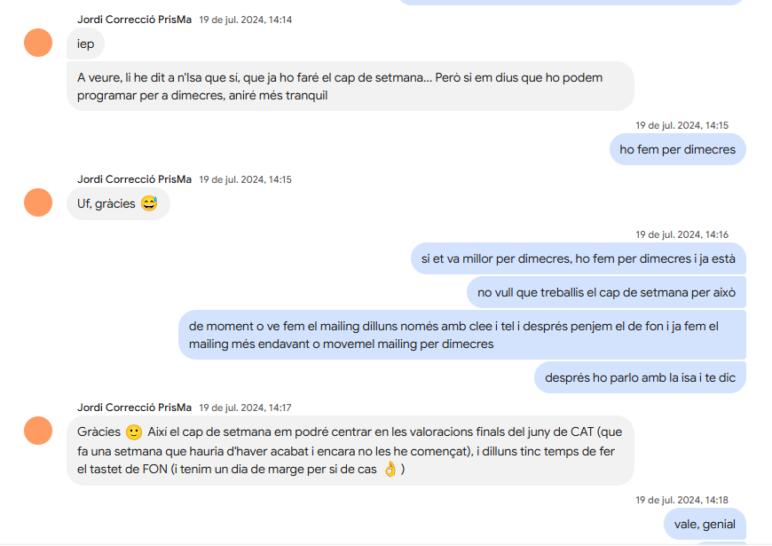

*Figura AD-1. Reprogramació d’una tasca per evitar que Jordi l’hagués de fer durant el cap de setmana. Fitxer: `CAP-GC-ADAPTACIO-2024-07-19-01_reprograma-dimecres-no-cap-setmana.png`.*

### CAP-GC-SUPORT-2025-04-10-03_temps-per-contestar.png

**Referència:** SUP-1

**Data i canal:** 10/04/2025 · Google Chat directe

**Contingut visible:** Fragment d’una conversa en què Meriem dona marge a Jordi per contestar i manté un to de suport.

**Abast:** Acredita el contingut visible del fragment, no el conjunt complet de la relació.

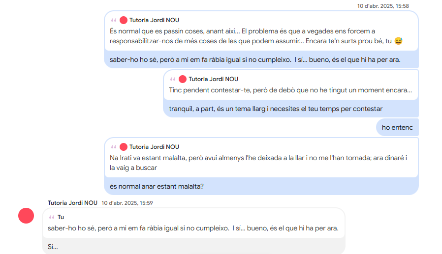

*Figura SUP-1. Marge temporal i resposta de suport dins la conversa del 10 d’abril de 2025. Fitxer: `CAP-GC-SUPORT-2025-04-10-03_temps-per-contestar.png`.*

### CAP-GC-SUPORT-2025-04-10-04_resposta-quan-puguis-familia.png

**Referència:** SUP-2

**Data i canal:** 10/04/2025 · Google Chat directe

**Contingut visible:** Meriem diu a Jordi que respongui quan pugui i pregunta per una situació familiar.

**Abast:** Acredita les paraules visibles i el to d’aquest fragment; no exclou que existissin desacords en altres moments.

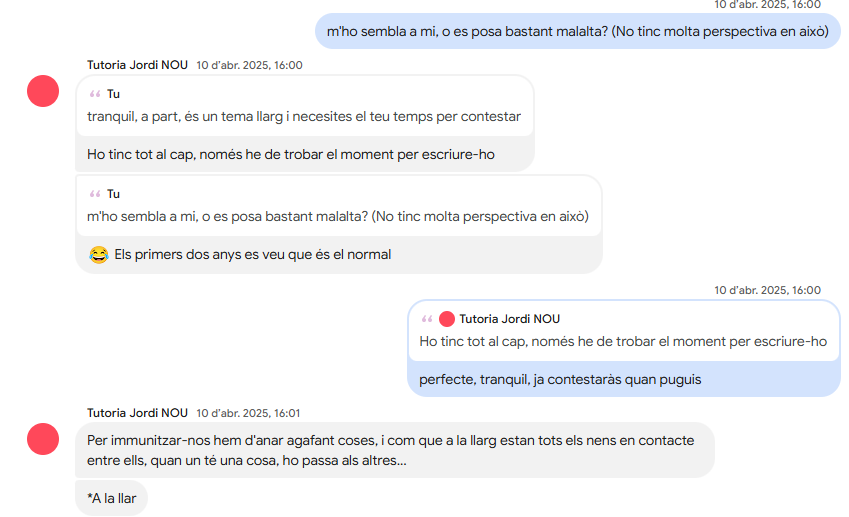

*Figura SUP-2. Marge per respondre i interès per la situació familiar de Jordi. Fitxer: `CAP-GC-SUPORT-2025-04-10-04_resposta-quan-puguis-familia.png`.*

### CAP-GC-SUPORT-2025-04-10-05_conciliacio-familia.png

**Referència:** SUP-3

**Data i canal:** 10/04/2025 · Google Chat directe

**Contingut visible:** Continuació de la conversa sobre conciliació, salut i necessitats familiars.

**Abast:** Mostra el contingut del fragment, però no acredita per si sol tota la gestió de la conciliació.

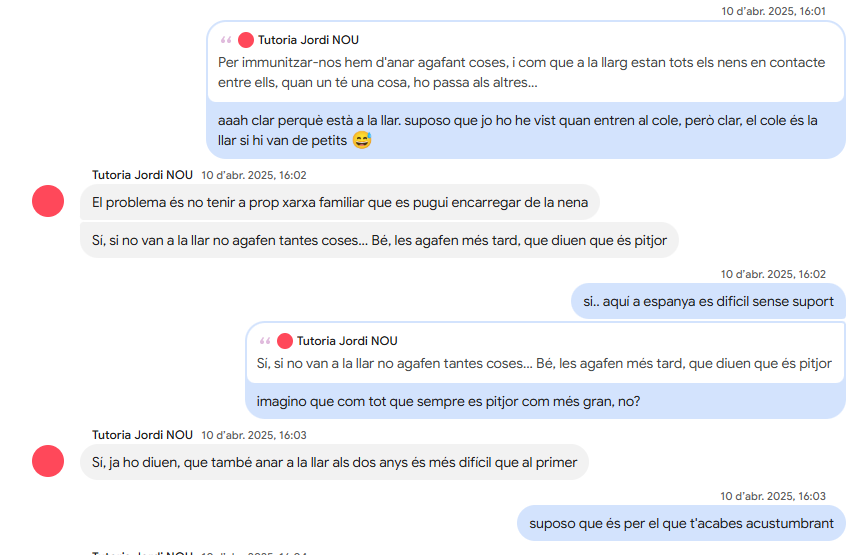

*Figura SUP-3. Conversa de suport vinculada a qüestions familiars i de conciliació. Fitxer: `CAP-GC-SUPORT-2025-04-10-05_conciliacio-familia.png`.*

### CAP-GC-SUPORT-2025-04-10-06_no-ens-faras-anar-malament.png

**Referència:** SUP-4

**Data i canal:** 10/04/2025 · Google Chat directe

**Contingut visible:** Meriem tranquil·litza Jordi i li diu que no farà anar malament l’equip.

**Abast:** Documenta aquesta expressió concreta i el context immediat visible.

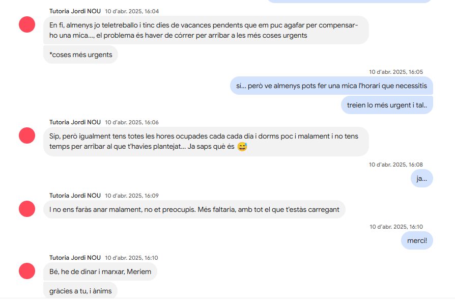

*Figura SUP-4. Missatge tranquil·litzador dins la conversa del 10 d’abril de 2025. Fitxer: `CAP-GC-SUPORT-2025-04-10-06_no-ens-faras-anar-malament.png`.*

## 2. Coordinació i seguiment de setembre de 2025

### CAP-GC-SETEMBRE-2025-09-16-01_publicacio-pendent-i-correus.png

**Referència:** SET-1

**Data i canal:** 16/09/2025 · Google Chat directe

**Contingut visible:** Meriem avisa que una publicació no constava corregida i pregunta si s’havia vist el correu agrupat; Jordi explica què havia revisat i identifica el material.

**Abast:** Acredita els missatges visibles i el moment de la consulta, no la causa completa del retard ni l’estat de totes les publicacions.

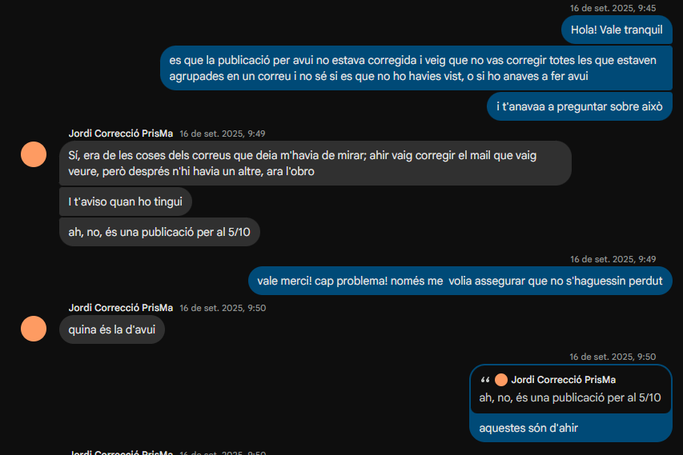

*Figura SET-1. Consulta sobre una publicació pendent i localització dels correus agrupats. Fitxer: `CAP-GC-SETEMBRE-2025-09-16-01_publicacio-pendent-i-correus.png`.*

### CAP-GC-SETEMBRE-2025-09-16-02_localitza-correus-i-corregeix.png

**Referència:** SET-2

**Data i canal:** 16/09/2025 · Google Chat directe

**Contingut visible:** Continuació en què Jordi localitza els quatre correus, diu que s’hi posa i comunica una correcció puntual; Meriem respon de manera cordial.

**Abast:** No acredita per si sola que tot el conjunt de tasques quedés finalitzat aquell dia.

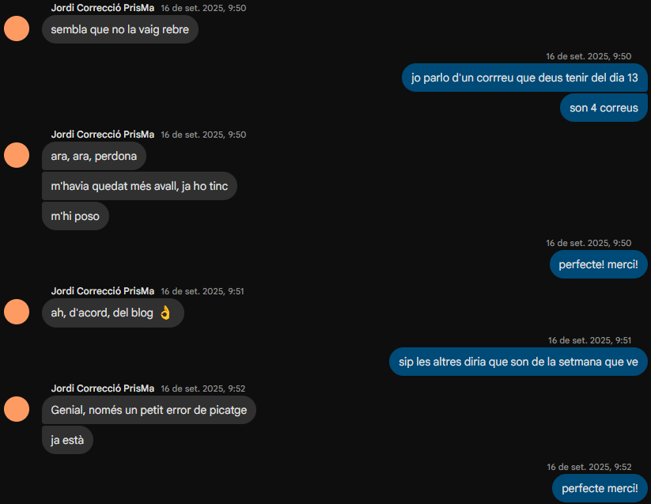

*Figura SET-2. Localització dels correus, inici de la revisió i comunicació d’una correcció puntual. Fitxer: `CAP-GC-SETEMBRE-2025-09-16-02_localitza-correus-i-corregeix.png`.*

### CAP-TR-FUNDAE-2025-09-09_15_recordatoris-ajuda-i-proposta.png

**Referència:** FUN-1

**Data i canal:** 09–15/09/2025 · Targeta de Trello

**Contingut visible:** La targeta de Fundae mostra la data de venciment, recordatoris de Meriem, una oferta d’ajuda i la resposta de Jordi indicant que la proposta estava feta.

**Abast:** La captura mostra l’estat visible de la targeta i alguns comentaris; no substitueix l’historial complet de Trello.

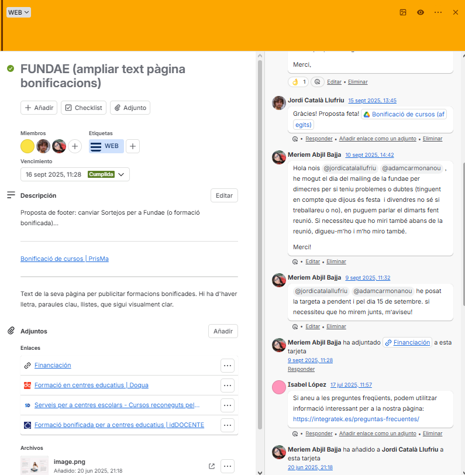

*Figura FUN-1. Seguiment de la tasca Fundae, recordatoris i oferta d’ajuda abans de l’entrega. Fitxer: `CAP-TR-FUNDAE-2025-09-09_15_recordatoris-ajuda-i-proposta.png`.*

### CAP-GC-FUNDAE-2025-09-16_revisio-pagina-i-seo.png

**Referència:** FUN-2

**Data i canal:** 16/09/2025 · Google Chat directe

**Contingut visible:** Conversa de revisió de la pàgina de Fundae: Jordi comunica avenços i dubtes, i Meriem respon sobre redacció, enllaços i SEO.

**Abast:** Documenta la revisió conjunta visible; no acredita per si sola l’estat íntegre de la pàgina ni tots els terminis previs.

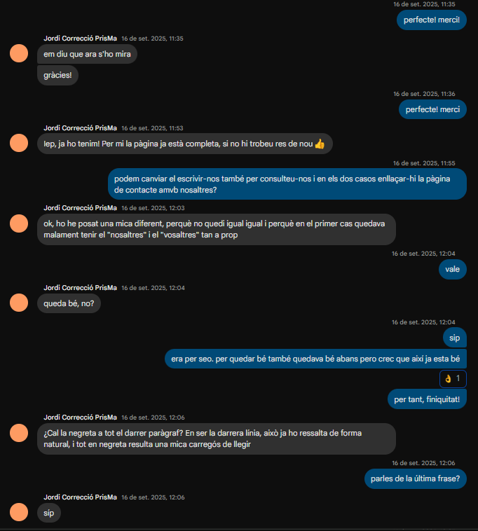

*Figura FUN-2. Revisió operativa de la pàgina de Fundae i resposta immediata sobre criteris de SEO. Fitxer: `CAP-GC-FUNDAE-2025-09-16_revisio-pagina-i-seo.png`.*

### CAP-GC-PACKS-2025-09-22_oferta-trucada-i-coordinacio.png

**Referència:** PACK-1

**Data i canal:** 22/09/2025 · Google Chat directe

**Contingut visible:** Meriem pregunta si Jordi està connectat, s’ofereix a explicar-li la qüestió i a trucar-lo; Jordi respon que acabarà un assumpte i després ho revisarà.

**Abast:** Mostra disponibilitat i coordinació en aquest moment, però no l’historial complet de la tasca.

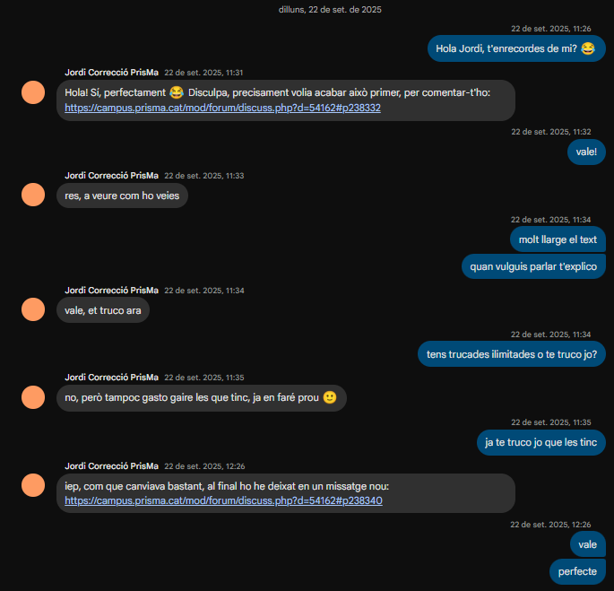

*Figura PACK-1. Oferta de trucada i disponibilitat directa per desbloquejar una tasca. Fitxer: `CAP-GC-PACKS-2025-09-22_oferta-trucada-i-coordinacio.png`.*

### CAP-GC-PACKS-2025-09-24_entrega-correccions-i-avis-isa.png

**Referència:** PACK-2

**Data i canal:** 24/09/2025 · Google Chat directe

**Contingut visible:** Jordi comunica que els textos estan llestos, comenta una decisió de format i diu que avisarà la Isa; Meriem respon en el mateix fil.

**Abast:** Acredita l’entrega i coordinació visibles, no els compromisos ni incidències anteriors.

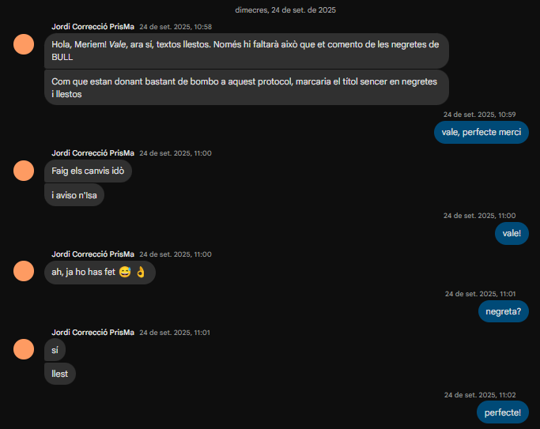

*Figura PACK-2. Comunicació d’entrega de correccions i coordinació amb la fase posterior de la Isa. Fitxer: `CAP-GC-PACKS-2025-09-24_entrega-correccions-i-avis-isa.png`.*

### CAP-GC-XARXES-2025-09-30_enllacos-pendents-i-confirmacio.png

**Referència:** XAR-1

**Data i canal:** 30/09/2025 · Google Chat directe

**Contingut visible:** Meriem envia cinc enllaços de publicacions; Jordi identifica una correcció pendent i més tard afirma que les ha revisat totes.

**Abast:** La captura acredita els cinc enllaços i la confirmació visible, però no permet determinar si representaven tot el conjunt pendent.

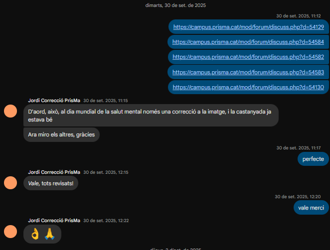

*Figura XAR-1. Enviament d’enllaços pendents i confirmació posterior de revisió. Fitxer: `CAP-GC-XARXES-2025-09-30_enllacos-pendents-i-confirmacio.png`.*

## 3. Disponibilitat, reunions i suport directe

### CAP-WA-JORDI-2023-05-16_arribada-tard-reunio.png

**Referència:** DISP-1

**Data i canal:** 16/05/2023 · WhatsApp directe

**Contingut visible:** Meriem pregunta a quina hora arribarà Jordi; ell primer indica les 10.45 i després comunica que ha perdut el bus, que arribarà a les 11.45 i que facin la reunió sense ell.

**Abast:** Acredita la conversa i els horaris comunicats; la captura no mostra per si sola l’hora oficial prevista de la reunió.

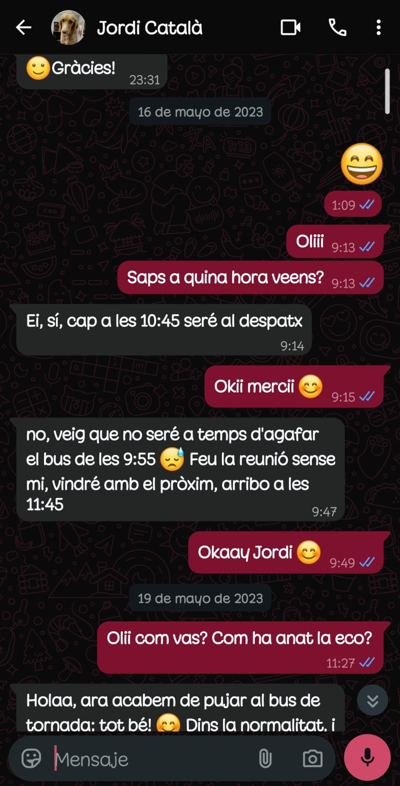

*Figura DISP-1. Canvi d’hora d’arribada i indicació de començar la reunió sense Jordi. Fitxer: `CAP-WA-JORDI-2023-05-16_arribada-tard-reunio.png`.*

### CAP-GC-DIRECTE-CURSOS-2025-06_2025-05-21_mpia-lectura-imatges-replantejar.png

**Referència:** SD-1

**Data i canal:** 21/05/2025 · Google Chat directe

**Contingut visible:** Jordi planteja un dubte sobre una lectura i les imatges de l’MPIA; Meriem respon en el mateix minut.

**Abast:** És un exemple concret de disponibilitat, no una mesura exhaustiva de tots els temps de resposta.

*Figura SD-1. Consulta sobre l’MPIA i resposta de Meriem en el mateix minut. Fitxer: `CAP-GC-DIRECTE-CURSOS-2025-06_2025-05-21_mpia-lectura-imatges-replantejar.png`.*

### CAP-GC-DIRECTE-CURSOS-2025-03_2025-06-02_prioritza-mpia-abans-gust.png

**Referència:** SD-2

**Data i canal:** 02/06/2025 · Google Chat directe

**Contingut visible:** Jordi planteja parlar d’algunes qüestions de les imatges i Meriem s’ofereix a fer-ho quan vulgui.

**Abast:** Acredita l’oferta visible en aquesta conversa concreta.

*Figura SD-2. Oferta de Meriem per revisar les imatges quan Jordi estigui disponible. Fitxer: `CAP-GC-DIRECTE-CURSOS-2025-03_2025-06-02_prioritza-mpia-abans-gust.png`.*

### CAP-GC-DIRECTE-CURSOS-2025-04_2025-06-02_trucada-cobertura.png

**Referència:** SD-3

**Data i canal:** 02/06/2025 · Google Chat directe

**Contingut visible:** Meriem diu que revisarà la qüestió i proposa trucar Jordi; la conversa reflecteix dificultats de cobertura.

**Abast:** Mostra l’intent de coordinació immediata, no el resultat complet de la trucada.

*Figura SD-3. Revisió immediata, proposta de trucada i incidència de cobertura. Fitxer: `CAP-GC-DIRECTE-CURSOS-2025-04_2025-06-02_trucada-cobertura.png`.*

### CAP-GC-DIRECTE-CURSOS-2025-05_2025-06-02_whatsapp-per-cobertura.png

**Referència:** SD-4

**Data i canal:** 02/06/2025 · Google Chat directe

**Contingut visible:** Davant els problemes de cobertura, Jordi proposa continuar per WhatsApp i Meriem hi accedeix en el mateix minut.

**Abast:** Acredita el canvi de canal i la resposta visible en aquest moment.

*Figura SD-4. Continuació per WhatsApp per evitar que la falta de cobertura bloquegés la tasca. Fitxer: `CAP-GC-DIRECTE-CURSOS-2025-05_2025-06-02_whatsapp-per-cobertura.png`.*

## 4. Conversa sobre prioritats del 2 d’octubre de 2025

### CAP-GC-JORDI-2025-10-02-01_no-vist-xat-gust-xarxes.png

**Referència:** CP-1

**Data i canal:** 02/10/2025 · Google Chat directe

**Contingut visible:** Inici de la seqüència: Meriem pregunta si Jordi treballa i es tracta el xat no vist, GUST i les xarxes.

**Abast:** S’ha d’interpretar conjuntament amb CP-2 a CP-7; per si sola no conté tota la conversa.

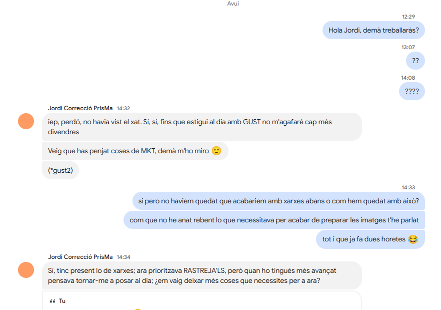

*Figura CP-1. Inici de la seqüència sobre el xat no vist, GUST i xarxes. Fitxer: `CAP-GC-JORDI-2025-10-02-01_no-vist-xat-gust-xarxes.png`.*

### CAP-GC-JORDI-2025-10-02-02_prioritza-rastrejals.png

**Referència:** CP-2

**Data i canal:** 02/10/2025 · Google Chat directe

**Contingut visible:** Jordi explica que havia prioritzat Rastreja’ls i que després tornaria a les xarxes.

**Abast:** Fragment consecutiu de la seqüència CP-1 a CP-7.

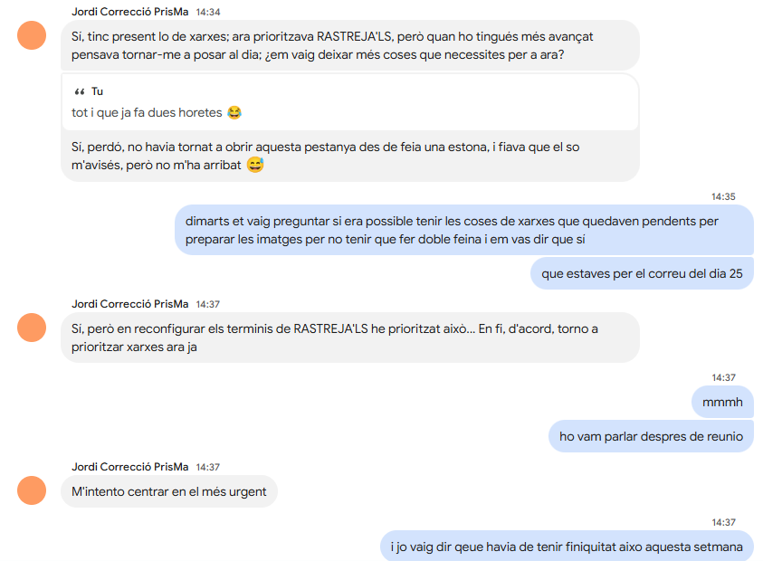

*Figura CP-2. Explicació de Jordi sobre la priorització de Rastreja’ls. Fitxer: `CAP-GC-JORDI-2025-10-02-02_prioritza-rastrejals.png`.*

### CAP-GC-JORDI-2025-10-02-03_malentès-prioritats.png

**Referència:** CP-3

**Data i canal:** 02/10/2025 · Google Chat directe

**Contingut visible:** Les parts contrasten què s’havia demanat i l’abast de les publicacions pendents.

**Abast:** Fragment consecutiu de la seqüència CP-1 a CP-7.

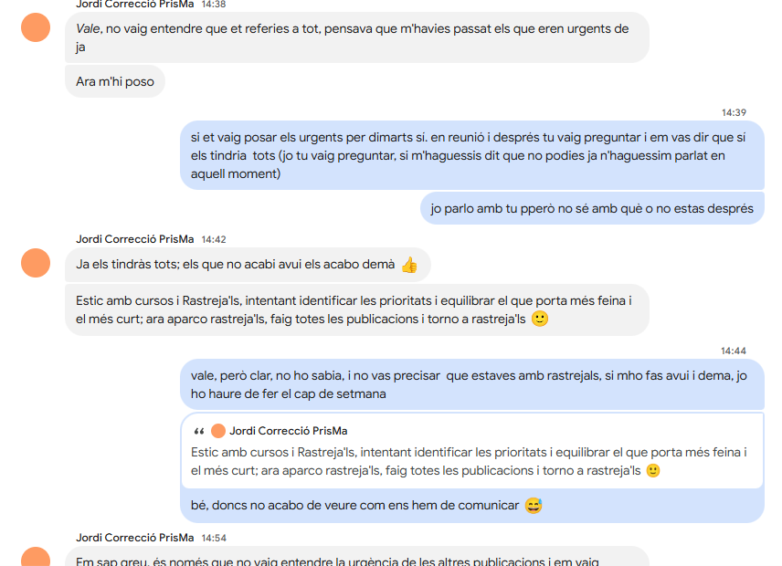

*Figura CP-3. Malentès sobre l’abast de les publicacions demanades. Fitxer: `CAP-GC-JORDI-2025-10-02-03_malentès-prioritats.png`.*

### CAP-GC-JORDI-2025-10-02-04_carrega-cap-setmana.png

**Referència:** CP-4

**Data i canal:** 02/10/2025 · Google Chat directe

**Contingut visible:** La conversa deriva cap a la càrrega, el cap de setmana i l’impacte de les tasques pendents.

**Abast:** Fragment consecutiu de la seqüència CP-1 a CP-7; reflecteix tensió de totes dues parts.

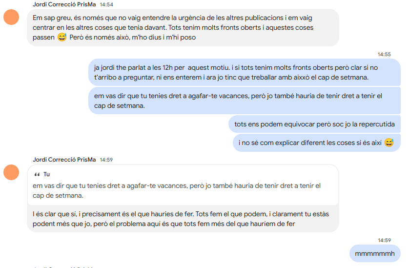

*Figura CP-4. Conversa sobre càrrega de feina, prioritats i cap de setmana. Fitxer: `CAP-GC-JORDI-2025-10-02-04_carrega-cap-setmana.png`.*

### CAP-GC-JORDI-2025-10-02-05_perjudici-mutuu.png

**Referència:** CP-5

**Data i canal:** 02/10/2025 · Google Chat directe

**Contingut visible:** Les dues parts expressen l’impacte i el perjudici que perceben.

**Abast:** Acredita les expressions visibles, no permet determinar per si sola la responsabilitat sobre el conflicte.

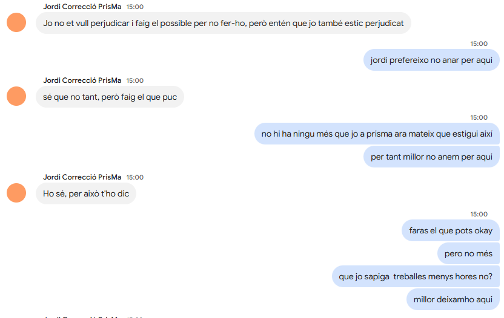

*Figura CP-5. Expressió del perjudici percebut per les dues parts. Fitxer: `CAP-GC-JORDI-2025-10-02-05_perjudici-mutuu.png`.*

### CAP-GC-JORDI-2025-10-02-06_hores-vacances-carrega.png

**Referència:** CP-6

**Data i canal:** 02/10/2025 · Google Chat directe

**Contingut visible:** Conversa sobre hores, vacances, càrrega i la manera com cadascú entenia l’esforç de l’altre.

**Abast:** Fragment consecutiu de la seqüència; no substitueix els registres objectius d’hores o vacances.

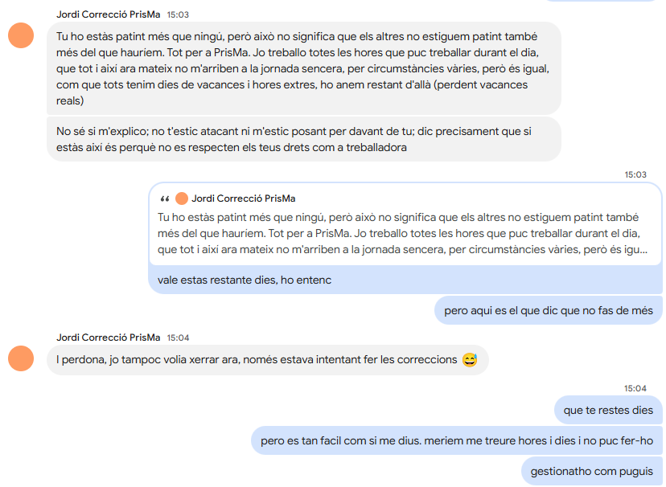

*Figura CP-6. Conversa sobre hores, vacances i càrrega. Fitxer: `CAP-GC-JORDI-2025-10-02-06_hores-vacances-carrega.png`.*

### CAP-GC-JORDI-2025-10-02-07_assumeix-malentes.png

**Referència:** CP-7

**Data i canal:** 02/10/2025 · Google Chat directe

**Contingut visible:** Tancament visible en què Jordi atribueix el problema a no haver entès la urgència de les darreres publicacions.

**Abast:** Acredita aquest reconeixement concret i s’ha de llegir amb tota la seqüència.

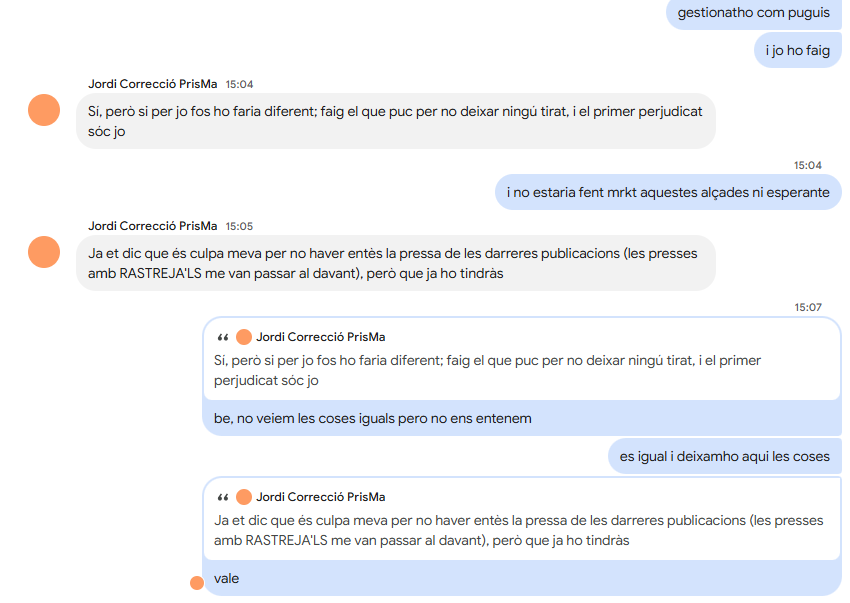

*Figura CP-7. Tancament en què Jordi assumeix el malentès sobre la urgència. Fitxer: `CAP-GC-JORDI-2025-10-02-07_assumeix-malentes.png`.*

## 5. Caps de setmana i reprogramacions

### CAP-WA-JORDI-2025-07-11_12_mailing-dilluns-alternativa.png

**Referència:** WA-1

**Data i canal:** 11–12/07/2025 · WhatsApp directe

**Contingut visible:** Davant la impossibilitat de reconnectar-se, Meriem ofereix que Jordi revisi el mailing dilluns a primera hora.

**Abast:** Documenta aquesta alternativa concreta, no la gestió de tots els terminis.

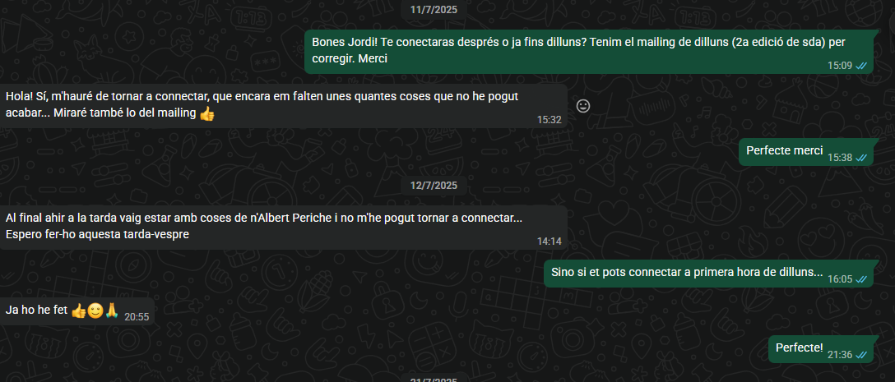

*Figura WA-1. Dilluns com a alternativa a revisar el mailing durant el cap de setmana. Fitxer: `CAP-WA-JORDI-2025-07-11_12_mailing-dilluns-alternativa.png`.*

### CAP-WA-JORDI-2025-09-12_fundae-no-diumenge-reprograma.png

**Referència:** WA-2

**Data i canal:** 12/09/2025 · WhatsApp directe

**Contingut visible:** Jordi diu que mirarà Fundae diumenge; Meriem respon «no cal diumenge» i explica que ho ha reprogramat a dimecres.

**Abast:** Acredita la reprogramació i les paraules visibles, no tots els antecedents de la tasca.

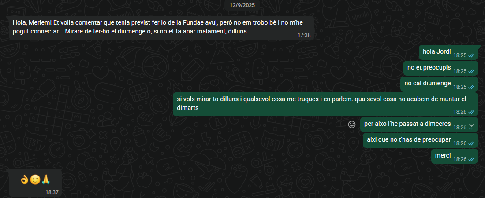

*Figura WA-2. Indicació expressa de no treballar diumenge i reprogramació de Fundae. Fitxer: `CAP-WA-JORDI-2025-09-12_fundae-no-diumenge-reprograma.png`.*

### CAP-WA-JORDI-2025-09-19_festa-parlar-dilluns.png

**Referència:** WA-3

**Data i canal:** 19/09/2025 · WhatsApp directe

**Contingut visible:** Meriem pregunta si Jordi té festa i totes dues parts acorden parlar dilluns; el to visible és cordial.

**Abast:** Documenta l’acord d’aquell dia i no l’estat complet de les tasques pendents.

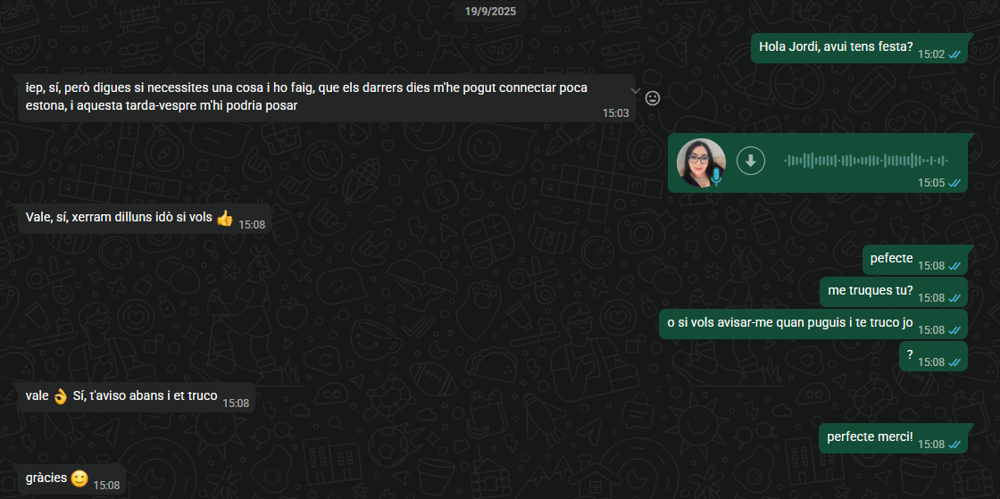

*Figura WA-3. Coordinació cordial i acord de reprendre la conversa dilluns. Fitxer: `CAP-WA-JORDI-2025-09-19_festa-parlar-dilluns.png`.*

## 6. MPIA: proposta d’imatges

### CAP-MPIA-2025-06-16_anotacio-mateix-model-propostes-filtres.png

**Referència:** MPIA-1

**Data i canal:** 16/06/2025 · Document de treball

**Contingut visible:** La captura mostra l’anotació «imatges nostres (amb el mateix model tota l’estona)» i sis alternatives visuals preparades.

**Abast:** No enregistra la trucada ni permet atribuir l’anotació a Jordi sense una prova addicional.

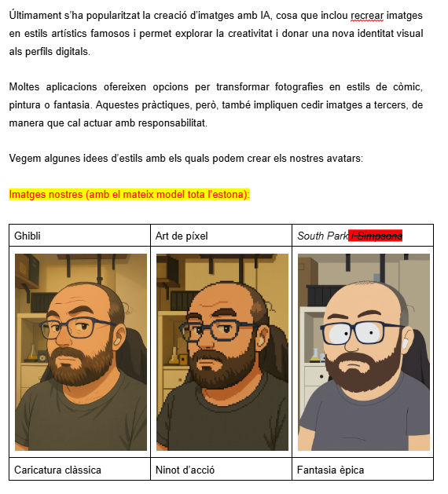

*Figura MPIA-1. Anotació visible i sis alternatives visuals preparades per a l’MPIA. Fitxer: `CAP-MPIA-2025-06-16_anotacio-mateix-model-propostes-filtres.png`.*

## 7. Tastet TUT

### CAP-TUT-2025-03-17-01_proposta-jordi-gonzalez-forum.png

**Referència:** TUT-1

**Data i canal:** 17/03/2025 · Fòrum de treball

**Contingut visible:** Proposta inicial de Jordi visible al fòrum del tastet TUT.

**Abast:** Documenta l’estat visible de la proposta en aquesta data, no tot l’historial de versions.

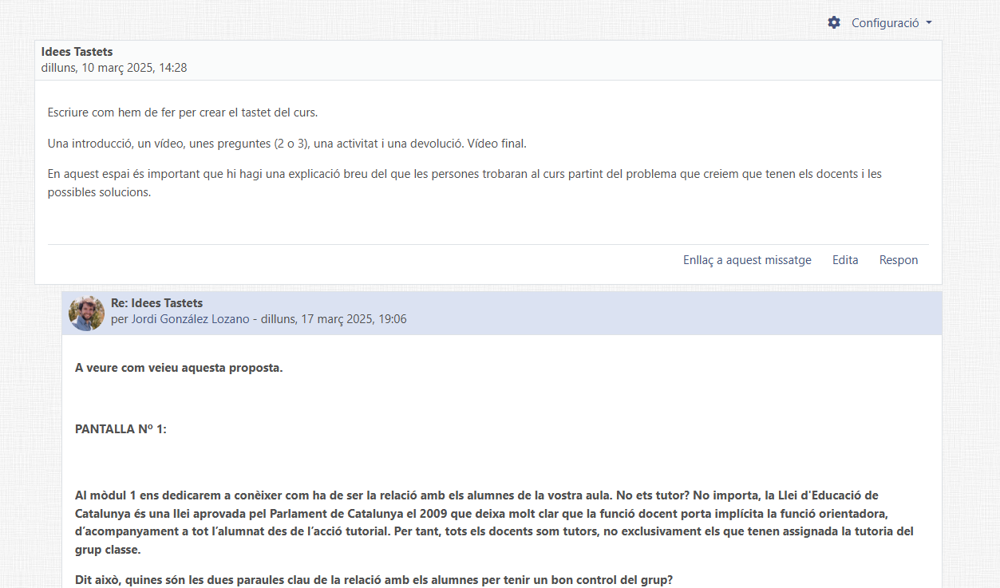

*Figura TUT-1. Proposta inicial visible al fòrum. Fitxer: `CAP-TUT-2025-03-17-01_proposta-jordi-gonzalez-forum.png`.*

### CAP-TUT-2025-04-15-01_isa-imatge-portada-patata-calenta.png

**Referència:** TUT-2

**Data i canal:** 15/04/2025 · Correu electrònic

**Contingut visible:** Isa enumera canvis fets i indica que encara falta la imatge de portada abans de passar la tasca a Meriem.

**Abast:** Acredita les tasques descrites al correu, no el temps complet invertit per cada persona.

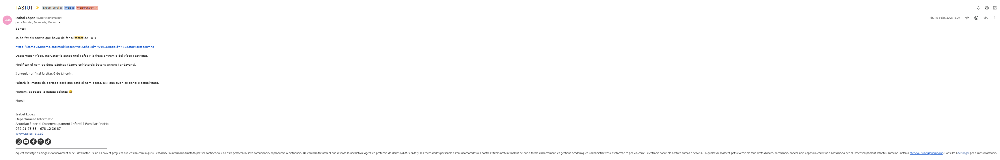

*Figura TUT-2. Isa enumera canvis i indica la imatge de portada pendent. Fitxer: `CAP-TUT-2025-04-15-01_isa-imatge-portada-patata-calenta.png`.*

### CAP-TUT-2025-04-15-02_meriem-ja-mhi-poso.png

**Referència:** TUT-3

**Data i canal:** 15/04/2025 · Correu electrònic

**Contingut visible:** Meriem respon immediatament que s’hi posa.

**Abast:** Acredita la resposta visible i el moment, no per si sola tota la programació posterior.

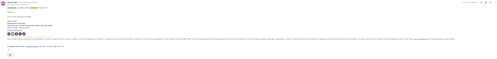

*Figura TUT-3. Resposta immediata de Meriem davant la tasca pendent. Fitxer: `CAP-TUT-2025-04-15-02_meriem-ja-mhi-poso.png`.*

### CAP-TUT-2025-04-15-03_jordi-llista-canvis-funcionals.png

**Referència:** TUT-4

**Data i canal:** 15/04/2025 · Correu electrònic

**Contingut visible:** Jordi comunica una llista de canvis textuals i funcionals sobre el tastet.

**Abast:** Documenta els canvis sol·licitats al correu, no la seva intenció ni l’esforç tècnic total.

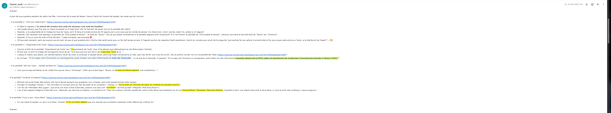

*Figura TUT-4. Canvis funcionals i textuals comunicats el 15 d’abril de 2025. Fitxer: `CAP-TUT-2025-04-15-03_jordi-llista-canvis-funcionals.png`.*

### CAP-TUT-2025-04-15-04_meriem-resposta-fet-i-reprogramacio.png

**Referència:** TUT-5

**Data i canal:** 15/04/2025 · Correu electrònic

**Contingut visible:** Meriem diferencia els canvis ja fets dels que exigien reprogramació o una nova decisió.

**Abast:** Acredita la seva resposta escrita; el temps tècnic es pot contrastar amb versions i registres.

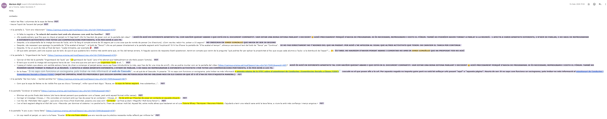

*Figura TUT-5. Diferenciació entre canvis fets i canvis que requerien reprogramació. Fitxer: `CAP-TUT-2025-04-15-04_meriem-resposta-fet-i-reprogramacio.png`.*

### CAP-TUT-2025-04-15-05_isa-canvis-facils-fets-i-resta-complicada.png

**Referència:** TUT-6

**Data i canal:** 15/04/2025 · Correu electrònic

**Contingut visible:** Isa diferencia les modificacions simples de les que requerien més feina i coordinació.

**Abast:** Documenta la valoració escrita d’Isa sobre els canvis visibles.

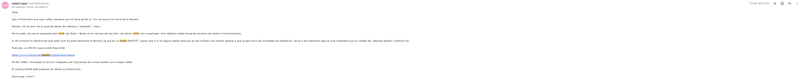

*Figura TUT-6. Diferenciació d’Isa entre canvis simples i canvis més complexos. Fitxer: `CAP-TUT-2025-04-15-05_isa-canvis-facils-fets-i-resta-complicada.png`.*

### CAP-TUT-2025-04-15-06_jordi-admet-canvis-programacio-i-aqui.png

**Referència:** TUT-7

**Data i canal:** 15/04/2025 · Correu electrònic

**Contingut visible:** Jordi reconeix que alguns canvis afectaven la programació i comenta l’ús d’«aquí».

**Abast:** Acredita el contingut visible del correu; no permet atribuir intencions ni valorar per si sol tot el procés.

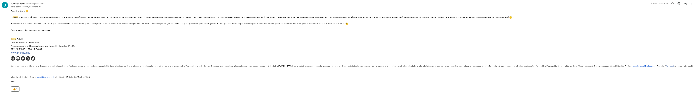

*Figura TUT-7. Reconeixement que alguns canvis afectaven la programació. Fitxer: `CAP-TUT-2025-04-15-06_jordi-admet-canvis-programacio-i-aqui.png`.*
